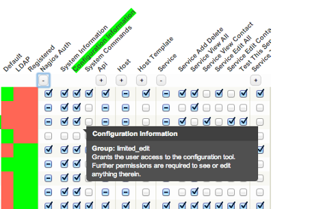
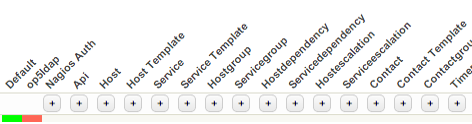
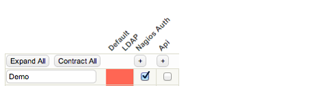
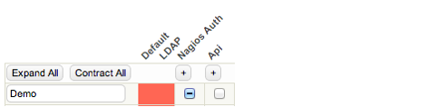
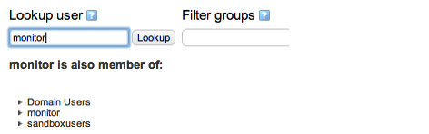
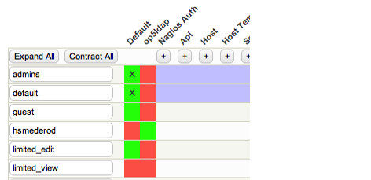
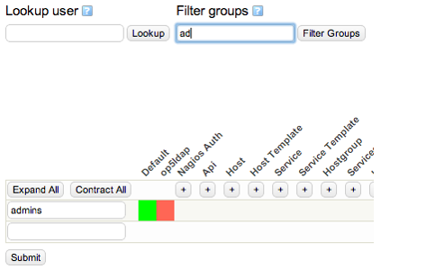

# Authorization

# About

The authorization is set under **Group rights** under configuration.

**Table of Content**

-   [About](#Authorization-About)
-   [Group rights](#Authorization-group_rightsGrouprights)
    -   [Expand/Contract authorization categories](#Authorization-Expand/Contractauthorizationcategories)
    -   [Select/Deselect all rights](#Authorization-Select/Deselectallrights)
    -   [Lookup user](#Authorization-Lookupuser)
    -   [Filter groups](#Authorization-Filtergroups)
    -   [Add, delete, rename groups](#Authorization-Add,delete,renamegroups)
    -   [Configuration files used by authorization](#Authorization-Configurationfilesusedbyauthorization)
    -   [Authorization points](#Authorization-Authorizationpoints)

# Group rights

Authorizations are only set on group(s). When an authorization point is hovered a tooltip will appear explaining what the setting does and the corresponding group and setting will be highlighted
 

## Expand/Contract authorization categories

The authorization categories are contracted by default. You can either choose to expand or contract all categories simultaneously by clicking the **Expand All** and **Contract All** buttons 
 or expand or contract them individually by clicking the +/- sign underneath each category.
 

## Select/Deselect all rights

To select or de-select all the rights in a group of rights, for example "Host" check the checkbox below the group of rights that you would like to add or remove.

 The minus sign  in the checkbox means that the group of rights is partially selected. Some rights in the group are checked.
 

## Lookup user

You can find out which groups a user is a member of by entering a username in the Lookup user text box and clicking the Lookup button.
 
 The groups that the user is a member will be highlighted and the authentication driver that they belong to will be indicated with an **X**.

 You will also get a list of additional groups the user is a member of underneath the Lookup user text box. An empty search string will hide the list and remove the highlights.

## Filter groups

By adding a filter text in the Filter groups text box and clicking Filter groups you can set a filter on the visible groups.

 Wildcard characters are neither supported nor needed. For example the filter strings "ad", "a" and "min" will all match a group called "admins".

 An empty filter string will reset the filter.

## Add, delete, rename groups

Renaming a group is done by typing a new name in the group name text box.

In the GUI you can create one new group each submit by filling the blank text box with the group name you want to create. To add a LDAP or Active Directory group type in the name of the group as it is named in your LDAP or Active Directory.
 Deletion of groups is done by removing the group name from the text box and leaving it blank when submitting your changes.

## Configuration files used by authorization

The file /etc/op5/auth\_groups.yml consists of all defined groups and their respective permissions.
 The GUI does not have to be used to edit authorization but we recommend that you use it to avoid syntax problems.

## Authorization points

### System Information

Gives the user access to the system/process information.

### Configuration Information

Gives the user access to view and change configuration

### System Commands

Gives the user access to issuing commands in the web gui.

### Api Command

Gives the user access to the HTTP-API commands interface which allows users issue external commands to Naemon. Authorized commands are dependent on if the user has 'system\_commands' for system wide commands, 'host edit' and 'service edit' for host/service specific commands.

### Api Config

Gives the user access to the HTTP-API configuration interface. Requires edit rights on corresponding object type.

### Api Status

Gives the user access to the HTTP-API status interface. Requires edit rights on corresponding object type.

### Api Report

Grants the user access to the HTTP-API report interface which allows users to fetch report data in a raw and uncorrupted way. Requires edit rights on corresponding object type.

### Host Add Delete

Gives the user right to add and delete hosts.

### Host View All

Gives the user right to view all hosts.

### Host View Contact

Gives the user right to view hosts that he/she is contact for.

### Host Edit All

Gives the user right to edit all existing hosts.

### Host Edit Contact

Gives the user right to edit hosts that he/she is contact for.

### Test This Host

Gives the user right to test the host that is being configured.

### Service Add Delete

Gives the user right to add and delete services.

### Service View All

Gives the user right to view all services.

### Service View Contact

Gives the user right to view services that he/she is contact for.

### Service Edit All

Gives the user right to edit all existing services.

### Service Edit Contact

Gives the user right to edit services that he/she is contact for.

### Test This Service

Gives the user right to test the service that is being configured.

### Hostgroup Add Delete

Gives the user right to add and delete hostgroups.

### Hostgroup View All

Gives the user right to view all hostgroups.

### Hostgroup View Contact

Gives the user right to view hostgroups that he/she is contact for.

### Hostgroup Edit All

Gives the user right to edit all existing hostgroups.

### Hostgroup Edit Contact

Gives the user right to edit hostgroups that he/she is contact for.

### Servicegroup Add Delete

Gives the user right to add and delete servicegroups.

### Servicegroup View Al

Gives the user right to view all servicegroups.

### Servicegroup View Contact

Gives the user right to view servicegroups that he/she is contact for.

### Servicegroup Edit All

Gives the user right to edit all servicegroups.

### Servicegroup Edit Contact

Gives the user right to edit servicegroups that he/she is contact for.

### Hostdependency Add Delete

Gives the user right to add and delete hostdependencies.

### Hostdependency View All

Gives the user right to view hostdependencies.

### Hostdependency Edit All

Gives the user right to edit hostdependencies.

### Servicedependency Add Delete

Gives the user right to add and delete servicedependencies.

### Servicedependency View All

Gives the user right to view servicedependencies.

### Servicedependency Edit All

Gives the user right to edit servicedependencies.

### Hostescalation Add Delete

Gives the user right to add and delete hostescalations.

### Hostescalation View All

Gives the user right to view hostescalations.

### Hostescalation Edit All

Gives the user tight to edit hostescalations.

### Serviceescalation Add Delete

Gives the user right to add and delete serviceescalations.

### Serviceescalation View All

Gives the user right to view serviceescalations.

### Serviceescalation Edit All

Gives the user right to edit serviceescalations.

### Contact Add Delete

Gives the user right to add and delete contacts.

### Contact View All

Gives the user right to view contacts.

### Contact Edit All

Gives the user right to edit contacts.

### Contactgroup Add Delete

Gives the user right to add and delete contactgrops.

### Contactgroup View All

Gives the user right to view contactgroups.

### Contactgroup Edit All

Gives the user right to edit contactgroups.

### Timeperiod Add Delete

Gives the user right to add and delete timeperiods.

### Timeperiod View All

Gives the user right to view timeperiods.

### Timeperiod Edit All

Gives the user right to edit timeperiods.

### Command Add Delete

Gives the user right to add and delete commands.

### Command View All

Gives the user right to view commands.

### Command Edit All

Gives the user right to edit commands.

### Test This Command

Gives the user right to execute commands.

### Template

Gives the user right to view and change templates.

### Wiki

Gives the user right to view, create and change docuwiki pages for objects he/she is authorized to see.

### Wiki Admin

Gives the user right to access the docuwiki admin panel.

### File

Gives the user right to change file in which an object is stored.

### Access Rights

Gives the user right to edit access rights.

### PNP

Gives the user right to access graphs.

### Saved Filters Global

Gives the user right to create and delete global filters for listviews.

### Export

Gives the user right to export or save it's own configuration.

### Host Template View All

Gives the user right to view host templates.

### Host Template Edit All

Gives the user right to edit host templates.

### Host Template Add Delete

Gives the user right to add and delete host templates.

### Service Template View All

Gives the user right to view service templates.

### Service Template Edit All

Gives the user right to edit service templates.

### Service Template Add Delete

Gives the user right to add and delete service templates.

### Contact Template View All

Gives the user right to view contact templates.

### Contact Template Edit All

Gives the user right to edit contact templates.

### Contact Template Add Delete

Gives the user right to add and delete contact templates.

### Configuration All

Gives the user right to export and import all configuration.

### Nagvis Add Delete

Global permission to add and delete all nagvis maps.

### Nagvis View

Global permission to view all nagvis maps.

### Nagvis Edit

Global permission to edit all nagvis maps.

### Nagvis Admin

Get full permission for nagvis, including global configuration

### Logger Access

Givs user access to view Logger interface

### Logger Configuration

Gives user access to modify Logger configuration

### Logger Schedule Archive Search

Gives user access to schedule Logger searches in archived logs

