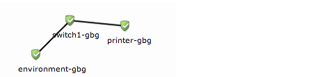
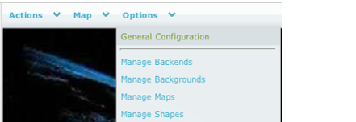
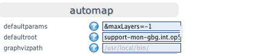

# Automap

# About 

When you take a look at the Automap for the first time you will see the complete tree, including all your hosts. If you only like to see one part of the tree you have to change the following configuration setting:
`defaultroot`
Defaultroot tells Nagvis what host to start your tree with.

# Example

Example of how the defaultroot works in NagVis Automap
 In this example we have the following tree in op5 Monitor.
 
 Here the **demo** host is set to **defaultroot** and all of its children are displayed.
 If you set the host **switch1-gbg** as **defaultroot** in Nagvis the automap only display **switch1-gbg** and it's children (**environment-gbg** and **printer-gbg**). The picture below shows how it would look like:*
* 

# Setting defaultroot

This is done when you have one of the maps in Edit mode. There is no Edit mode on the automap so these steps have to be done on another map.

## To set defaultroot.

1.  Open Nagvis.
2.  Go to the top menu and choose: **Option -\> General Configuration**
    
3.  In the **Automap** section and type in the complete host name in the "defaultroot" text box:
    
4.  Click **Save** and the new setting has been saved.

