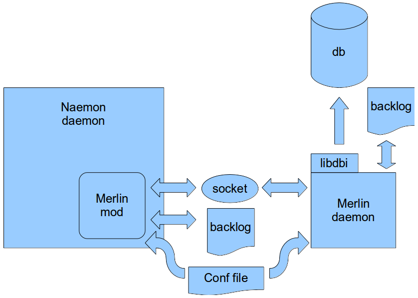

# Backend parts

# About

This chapter describes the backend of op5 Monitor 

**Table of Content**

-   [About](#Backendparts-About)
-   [Backend parts](#Backendparts-Backendparts)
    -   [merlin-mod](#Backendparts-merlin-mod)
    -   [merlind](#Backendparts-merlind)
    -   [merlin database](#Backendparts-merlindatabase)
-   [Backend Layout](#Backendparts-BackendLayout)

# Backend parts

## merlin-mod

Responsible for jacking into the NEBCALLBACK\_\* calls and send them to a socket. If the socket is not available the events are written to a backlog and sent when the socket is available again.

## merlind

The Merlin daemon listens to the socket that merlin-mod writes to and sends all events received either to a database of your choice (using libdbi) or to another merlin daemon. If the daemon is unsuccessful in this it writes to a backlog and sends the data later.

## merlin database

This is a database that includes Naemon object status and status changes. It also contains comments, scheduled downtime etc.

# Backend Layout

Describes the workflow of the op5 Monitor backend

