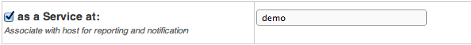

# Business services

# About

A business object is a group that can be populated with hosts and services from hosts and host groups. 
It is also possible to add sub-groups that can have their own rule-set.

**Table of Content**

-   [About](#Businessservices-About)
-   [Creating a new group](#Businessservices-creating-new-groupCreatinganewgroup)
-   [Creating a sub-element](#Businessservices-Creatingasub-element)
    -   [Add a monitored object](#Businessservices-Addamonitoredobject)
    -   [Add a group as sub-element](#Businessservices-Addagroupassub-element)
-   [Rules types](#Businessservices-Rulestypes)
    -   [Worst state](#Businessservices-Worststate)
    -   [Best state](#Businessservices-Beststate)
    -   [Simple At least](#Businessservices-SimpleAtleast)
    -   [At least](#Businessservices-Atleast)
    -   [At most](#Businessservices-Atmost)
    -   [Scores](#Businessservices-Scores)
    -   [Custom rules](#Businessservices-Customrules)
-   [Publish as a service](#Businessservices-Publishasaservice)
-   [Reporting](#Businessservices-Reporting)

# Creating a new group

To create a new group go to "Business Process" in the menu.
 
 Click on the "New Object" button at top-right area
 
 Select rule for your business process group

 Fill in the name of the group

 Enter the parameters of the rule, if any.

 Click on the "Create" button

 Click on the "Save" icon.

# Creating a sub-element

A sub-element is either a service, a host or another group with it's own rule-set.
 To add the sub-element click "add sub-element" icon in actions icons column

## Add a monitored object

Select what type of object you what to add. In the example below we use **Service**

 Select which object by clicking in the empty text field and select you object from the drop-down menu.

 Click on the "Save" icon.
 

## Add a group as sub-element

Select the type of rule-set the group shall have. Then follow the steps in Creating a new group.

# Rules types

There are currently 6 different rule types to choose from, each group has their unique rule set.

<table>
<colgroup>
<col width="50%" />
<col width="50%" />
</colgroup>
<tbody>
<tr class="odd">
<td align="left">
<strong>Group</strong>

<strong>Description</strong>
</td>
<td align="left">
Worst state

Returns the worst state of all its sub-elements
</td>
</tr>
</tbody>
</table>

## Worst state

Group state will be the worst state of all its sub-elements

### Examples

Worst State of {OK, WARNING, CRITICAL} =\> CRITICAL
 Worst State of {OK, WARNING, CRITICAL, UNKNOWN} =\> UNKNOWN

## Best state

Group state will be the best state of all its sub-elements

### **Examples**

Best State of {WARNING, CRITICAL} =\> WARNING
 Best State of {OK, WARNING, CRITICAL, UNKNOWN} =\> OK

## Simple At least

Means to express the idea that you need some amount of services up and running for the delivered service to be functional. The number of sub-elements that has to be OK is specified in percentage or actual amount. If the number of sub-elements that are OK are equal or more than the at-least number or percentage then the group will be OK, or else the group will get the worse state of its sub-elements.

### **Examples**

Simple At least(2, num) of {OK, OK, CRITICAL, CRITICAL} =\> OK
 Simple At least(3, num) of {OK, OK, WARNING, CRITICAL} =\> CRITICAL
 Simple At least(3, num) of {OK, OK, WARNING, WARNING} =\> WARNING
 Simple At least(50, %) of {OK, OK, WARNING, CRITICAL} =\> OK
 Simple At least(50, %) of {OK, OK, WARNING, CRITICAL, CRITICAL} =\> CRITICAL

## At least

Means to express the idea that you need some amount of services up and running to be functional and lesser amount to be semi-functional (e.g. with degraded performance). Two thresholds are specified, percentage or actual among is possible:
 If the number of OK sub-elements is grater or equal than the OK threshold then group is OK
 If the number of OK sub-elements is less then the OK threshold but greater or equal than the WARNING threshold then group is WARNING
 If number of OK sub-elements is less then the WARNING threshold then group is CRITICAL

### **Examples**

At least(2,1,num) of {OK, OK, WARNING, CRITICAL} =\> OK
 At least(3,2,num) of {OK, OK, WARNING, CRITICAL} =\> WARNING
 At least(3,2,num) of {OK, WARNING, WARNING, CRITICAL} =\> CRITICAL
 At least(3,2,num) of {OK, WARNING, WARNING, WARNING} =\> CRITICAL

## At most

Means to express the idea that you can tolerate some amount of problems. Two thresholds are specified either in percentage or actual among.
 If number of problematic sub-elements is greater or equal to the CRITICAL threshold then group is CRITICAL
 If number of problematic sub-elements is less than CRITICAL threshold but greater or equal to the WARNING threshold then group is WARNING
 If number of problematic sub-elements is less than the WARNING threshold then the group is OK

### **Examples**

At most(2,1,num) of {OK, OK, WARNING, CRITICAL} =\> OK
 At most(3,2,num) of {OK, OK, WARNING, CRITICAL} =\> WARNING
 At most(3,2,num) of {OK, WARNING, WARNING, CRITICAL} =\> CRITICAL
 At most(3,2,num) of {OK, WARNING, WARNING, WARNING} =\> CRITICAL

## Scores

Means to express the idea that having several WARNING sub-elements is the same as having few OKs and few CRITICALs. Groups sums the problems points of all its children using:
 OK state gives 0 problems points
 WARNING = 1
 CRITICAL = 2
 UNKNOWN = 3
 Then checks it against two specified thresholds.
 If sum is less than the WARNING points then group is OK
 if sum is between the WARNING and CRITICAL points then group is WARNING
 if sum is greater or equal than the CRITICAL points then group is CRITICAL

### **Examples**

Scores(4,3,num) of {OK, OK, WARNING, CRITICAL} =\> WARNING
 Scores(4,3,num) of {OK, WARNING, WARNING, WARNING} =\> WARNING
 Scores(4,3,num) of {WARNING, WARNING, WARNING, WARNING} =\> CRITICAL
 Scores(4,3,num) of {OK, OK, CRITICAL, CRITICAL} =\> CRITICAL

## Custom rules

It is possible to create your own custom rules. This is done in a script language called LUA.
 See chapter custom rules (not yet written).

# Publish as a service

It is possible to publish an object as a service of a host. By doing this the object will get the same possibilities as a service in Monitor such as notifications, reports, graphs and so on.
 To publish an object edit the object that you want to publish and select "as a service" and the host on which to publish the object.
 
 The object will now be found under the host as a service.

# Reporting

When creating a SLA or Availability report out of a BSM top level element that has been published to a host it is possible to include the BSM events in that report.
 This will show the underlying checks that triggered a WARNING or CRITICAL alert in the BSM.
 To enable this choose to include BSM event when creating a report.
 If the selected BSM service is not a top level element, no BSM events will be displayed.
 To enable this choose to **include BSM event** when creating a report.
 
 When the report is generated the event will be included in the report.
 

