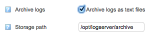

# Configuring Logger settings

# About 

The Logger configuration page allows you to tweak storage settings, log rotation and similar.

**Table of Content**

-   [About ](#ConfiguringLoggersettings-About)
-   [Configuration](#ConfiguringLoggersettings-Configuration)
    -   [Database retention](#ConfiguringLoggersettings-Databaseretention)
    -   [Log Archive](#ConfiguringLoggersettings-LogArchive)
-   [Log Monitoring](#ConfiguringLoggersettings-LogMonitoring)

# Configuration

To access the Logger configuration go to the configuration page and click on **Logger Configuration

**

In Logger configuration you can configure

-   -   Database retention
    -   Log archive 

## Database retention

Logs are rotated out from the database when they reach a certain age.
This can be configured using the **Keep in database** option. 

The default database retention setting is 192 hours (=8 days). This should be sufficiently short to not require too much disk space, while keeping enough data to evaluate Logger and decide on storage requirements and suitable retention times. The op5 Monitor machine might run out of disk if many log messages are received. The op5 Monitor self-monitoring (enabled by default on new installations) will warn if the server is running out of disk space.

## Log Archive

A log archive can be set to store the logs in. The archive will not have any retention time.
To enable log archive check the **Archive logs** checkbox and specify an absolut **storage path** on the op5 Monitor server.
**

**In the default configuration archiving is disabled, this is to avoid filling up disk space on the op5 Monitor server.

We recommend to configure a remote storage for the archive, both for security reasons in case of hardware failure and for storage reasons.

Things to consider when log archive is turned on:

-   When log archive is turned on, the archive search feature will utilize the text files instead of the database.
-   Archived files are **not** rotated automatically. A retention / clean up policy must be put in place to clear out old log files.
-   Archive logging starts when the feature is turned on. This means that the archive search feature will only show messages starting when archive logging was turned on.
-   If archiving is turned off, existing files are kept on disk.

Since the archive will not automatically be rotated logs will be stored indefinitely.

# Log Monitoring

If you want to learn about monitoring log patterns, see the "[Monitoring log filters in op5 Monitor 7.0 or later](https://kb.op5.com/display/HOWTOs/Monitoring+log+filters+in+Monitor+7.0+or+higher)"

 

