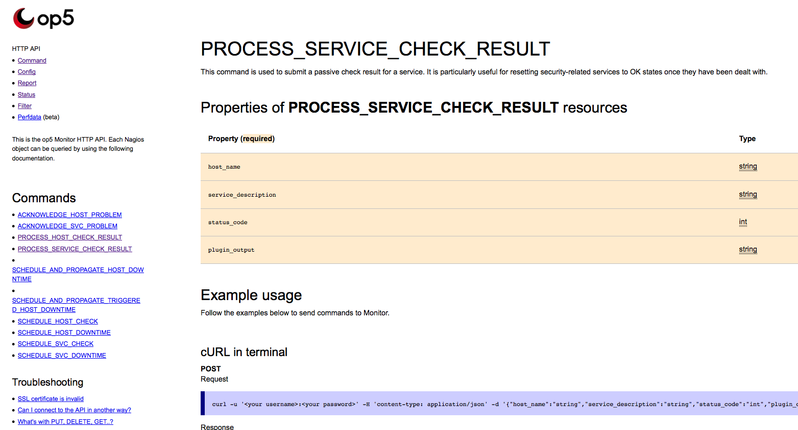

# Creating an HTTP API driven command-line tool

Version

This article was written for version 7.0 of op5 Monitor, it could work on both lower and higher version if nothing else is stated.

Articles in the Community-Space are not supported by op5 Support.

Deprecation consideration

The current HTTP API command support will become deprecated though remain functional for an undetermined future.

We are in the process of revising the command API structure into a better substitute.

 

 

## About

This how-to was made for you to learn how to build your own tool for executing remote commands against the HTTP API, you may download the finished script directly and utilize it as you wish without warranty or support, we do highly recommend you to read through the guide to gain the knowledge of maintaining and extending the script. To follow this guide it is recommended that you have a basic grasp of Linux and PHP.

The op5 Monitor HTTP API is an HTTP service supplying data and actions, from and to, op5 Monitor for integration with external services, scripts or tools. It is the recommended and supported way of communicating with op5 Monitor from external sources.

Getting started with the op5 Monitor HTTP API may be bulky for regular use in a command line or scripts written in languages that do not have easy interfaces for HTTP requests. This article will remedy that by showing you how you may create your own tools that utilize the HTTP API to fulfill some uses that NSCA serves (or served).

NSCA, Nagios Service Check Acceptor, is a daemon and CLI tool for submitting passive service checks to Nagios or Naemon.

### Why use the HTTP API when we have NSCA available?

NSCA is a generalized tool for submitting commands to Nagios and some derivatives thereof (e.g. Naemon), it is a direct hook into the command interface of Nagios, skipping any authentication layers supplied by op5 monitor, for that reason alone you should want to build on the HTTP API. As the HTTP API is tailored to fit straight into the authentication and relation structure given by op5 Monitor. In essence you can only do with the API what you can do in the web interface given the same user.

Furthermore op5 Monitor extends the functionality of Naemon and will provide more commands which will not be reflected in NSCA as it maps directly to Nagios.

 Our target is to gain a command line interface as simple as possible that will not negate the gains of running over the HTTP API as discussed above. op5 does not support this as user requirements vary wildly. By instead stabilizing and grounding the HTTP API we can support more use cases at a smaller zone than then CLI tool ever could.

This theoretical command that we will put into practice during this guide will look something like this:

``` {.bash data-syntaxhighlighter-params="brush: bash; gutter: false; theme: Confluence" data-theme="Confluence" style="brush: bash; gutter: false; theme: Confluence"}
op5remote result host;service 0 "This service is a-okay"
```

-   [About](#CreatinganHTTPAPIdrivencommand-linetool-About)
    -   [Why use the HTTP API when we have NSCA available?](#CreatinganHTTPAPIdrivencommand-linetool-WhyusetheHTTPAPIwhenwehaveNSCAavailable?)
-   [Command line](#CreatinganHTTPAPIdrivencommand-linetool-Commandline)
-   [Creating a tool for the job](#CreatinganHTTPAPIdrivencommand-linetool-Creatingatoolforthejob)
    -   [Error handling](#CreatinganHTTPAPIdrivencommand-linetool-Errorhandling)
-   [Generalizing](#CreatinganHTTPAPIdrivencommand-linetool-Generalizing)
    -   [Extending](#CreatinganHTTPAPIdrivencommand-linetool-Extending)
-   [Installation](#CreatinganHTTPAPIdrivencommand-linetool-Installation)
-   [Summary](#CreatinganHTTPAPIdrivencommand-linetool-Summary)
    -   [Acknowledge hosts](#CreatinganHTTPAPIdrivencommand-linetool-Acknowledgehosts)
    -   [Acknowledge services](#CreatinganHTTPAPIdrivencommand-linetool-Acknowledgeservices)
    -   [Submit passive host results](#CreatinganHTTPAPIdrivencommand-linetool-Submitpassivehostresults)
    -   [Submit passive service results](#CreatinganHTTPAPIdrivencommand-linetool-Submitpassiveserviceresults)
-   [The finished tool](#CreatinganHTTPAPIdrivencommand-linetool-Thefinishedtool)

## Command line

To start of this article we will check what is required to submit a passive check result using HTTP API over the command line. For information about this follow these steps:

1.  Navigate to "**\<your monitor host\>/api**"
2.  Log in
3.  Click "**Command**" in the left-side menu
4.  Then "**PROCESS\_SERVICE\_CHECK\_RESULT**"
    1.  (or navigate directly to "/api/help/command/**PROCESS\_SERVICE\_CHECK\_RESULT**")

This will show you the HTTP API help page for submitting a passive check result for services (see image), looking down at the page you are supplied with multiple examples but we will look at the command line cURL example which looks like the following command

 



``` {.bash data-syntaxhighlighter-params="brush: bash; gutter: false; theme: Confluence" data-theme="Confluence" style="brush: bash; gutter: false; theme: Confluence"}
curl -u '<your username>:<your password>' -H 'content-type: application/json' -d '{"host_name":"string","status_code":"int","plugin_output":"string"}' 'https://<your monitor host>/api/command/PROCESS_SERVICE_CHECK_RESULT'
```

The examples above contains type information expected by the command, such as "string" and "int", if populated with data it would look something like below, given a host called **host** and a service called **service** and op5 Monitor running at **127.0.0.1**:

``` {.bash data-syntaxhighlighter-params="brush: bash; gutter: false; theme: Confluence" data-theme="Confluence" style="brush: bash; gutter: false; theme: Confluence"}
curl -u '<your username>:<your password>' -H 'content-type: application/json' -d '{"host_name":"host","service_description":"service","status_code":"0","plugin_output":"The backup was flawless"}' 'https://127.0.0.1/api/command/PROCESS_SERVICE_CHECK_RESULT'
```

That is a mouthful to type, in a script it may be okay, but for everyday use from the command line it's not feasible to remember the order, number and properties of the arguments required. Though we may argue that actions requiring user-interaction should be done via our web interface there are some things you'd wish was easy to do by a swift command. So what do we do now?

## Creating a tool for the job

We will create a tool to help us submit just this explicit command at first, then by generalizing and error handling extend that tool, but before you copy-paste and run away I would advise you to read through this guide as the end-result is far better given that you understand how it works and how you may extend it to support all commands that the op5 Monitor HTTP API currently supplies.

We will create this tool in PHP but following the examples seen on the help page we visited before, you could create it in bash or python using the same logic.

This script is unsupported by op5, if you find errors it should be reported as spelling mistakes in the op5 Knowledge Base.

**example1.php**  Expand source

``` {.php data-syntaxhighlighter-params="brush: php; gutter: false; theme: Confluence; collapse: true" data-theme="Confluence" style="brush: php; gutter: false; theme: Confluence; collapse: true"}
#!/usr/bin/php
<?php
/**
 * This script can only run the PROCESS_SERVICE_CHECK_RESULT, i.e. send a passive
 * check on a service. It does so far not handle any possible PHP errors that may
 * occur on faulty input. But given that you run:
 *
 *   ./example1.php monitor "Zombie processes" 0 "OK: Everything is fine and dandy"
 *
 * It will execute properly, and set the service to state 0 (i.e. OK) with the
 * output "OK: Everything is fine and dandy".
 */

// To keep static information separated and easily accessible when customizing the 
// script for a new host or user we set monitor host, user and password here.
define('MONITOR_HOST', '<your monitor host>');
define('MONITOR_USER', '<your monitor user>');
define('MONITOR_PASS', '<your monitor pass>');

// We will send the data to the HTTP API as JSON, adding the data given from the command-line
// which is stored in the $argv variable in PHP.
 $data = json_encode(array(
  "host_name" => $argv[1],
  "service_description" => $argv[2],
  "status_code" => intval($argv[3]),
  "plugin_output" => $argv[4]
));

$a_handle = curl_init('https://' . MONITOR_HOST . '/api/command/PROCESS_SERVICE_CHECK_RESULT');

// Tell the API that this is JSON
curl_setopt($a_handle, CURLOPT_HTTPHEADER, array('Content-Type: application/json'));

// Tell the API who we are
curl_setopt($a_handle, CURLOPT_USERPWD, MONITOR_USER . ':' . MONITOR_PASS);

// Tell curl that this is a HTTP POST
curl_setopt($a_handle, CURLOPT_POST, 1);

// Tell curl that we want to see the result of the request
curl_setopt($a_handle, CURLOPT_RETURNTRANSFER, TRUE);

// And give curl the data we are about to send
curl_setopt($a_handle, CURLOPT_POSTFIELDS, $data);

// By default monitor is installed with a self-signed certificate, if you have a proper
// SSL cert. you may remove this line, otherwise you need to keep it.
curl_setopt($a_handle, CURLOPT_SSL_VERIFYPEER, false);

// Execute the curl request and json decode the result
$result = curl_exec($a_handle);
$result = json_decode($result, true);

/**
 * This script relies on the monitor HTTP API to handle errors and return them
 * in a printable format. This could write to a log instead of printing depending
 * on your needs.
 *
 * Errors from API POST's contain an "error" and "full_error" member, successes
 * contain a "result" member.
 */
if ($result['error']) {
  echo $result['error'] . "\n";
  echo $result['full_error'] . "\n";
  exit(1);
} elseif ($result['result']) {
  echo $result['result'] . "\n";
  echo sprintf("On service '%s' of host '%s'\n", $argv[2], $argv[1]);
}
```

This tool can only submit the PROCESS\_SERVICE\_CHECK\_RESULT command and will not handle invalid inputs into the script, which means that the script can result in PHP errors and/or send bad data to the monitor API. So we have to secure the script somewhat and generalize it a bit.

### Error handling

This script is unsupported by op5, if you find errors it should be reported as spelling mistakes in the op5 Knowledge Base.

**example2.php**  Expand source

``` {.php data-syntaxhighlighter-params="brush: php; gutter: false; theme: Confluence; collapse: true" data-theme="Confluence" style="brush: php; gutter: false; theme: Confluence; collapse: true"}
#!/usr/bin/php
<?php
/**
 * This script can run the PROCESS_SERVICE_CHEK_RESULT and PROCESS_HOST_CHECK_RESULT
 * based on parameters given, that is given you submitted host AND service name or
 * simply the host name. The first submits a service result, the second a host
 * result.
 *
 *   ./example2.php "monitor;Zombie processes" 0 "OK: Everything is fine and dandy"
 *   ./example2.php "monitor" 0 "UP: Everything is fine and dandy"
 *
 * It also has some failsafes for improper or forgotten input which it handles by
 * setting this parameters to types which are not allowed for that field in the HTTP
 * API, the API will supply a proper error message when executing.
 *
 * plugin_output is not required for the command so executing:
 *
 *   ./example2.php "monitor" 0
 *
 * Will be successfull and the output will be set to empty.
 */
define('MONITOR_HOST', '<your monitor host>');
define('MONITOR_USER', '<your monitor user>');
define('MONITOR_PASS', '<your monitor pass>');

/**
 * This script takes the host and service identifiers in naemon/nagios style,
 * separated by a semicolon. i.e. "host;service"
 */
$key = explode(';', $argv[1]);
$host = $key[0];

// This is the ternary operator, I will use it during these scripts
// for setting values or defaults, in simple terms think of them as
// (if) ? then : else, in this case if $key[1] isset, assign that to
// $service else assign false to service, since no service description
// was supplied. 
$service = (isset($key[1])) ? $key[1] : false;
/**
 * Validate that status_code and plugin_output are set, if status_code is not an
 * integer set it to an invalid value so that the API returns an error.
 */
$state = (isset($argv[2]) && is_numeric($argv[2])) ? intval($argv[2]) : false;
$output = (isset($argv[3])) ? $argv[3] : false;
$data = array(
  "host_name" => $host,
  "status_code" => $state,
  "plugin_output" => $output
);

// Only add "service_description" if this is a service request
if ($service) {
  $data['service_description'] = $service;
}

// Select command based on whether a service was given or not
$command = ($service) ? 'PROCESS_SERVICE_CHECK_RESULT' : 'PROCESS_HOST_CHECK_RESULT';

// Build the URL from MONITOR_HOST name and determined $command
$url = sprintf('https://%s/api/command/%s', MONITOR_HOST, $command);
$data = json_encode($data);

/**
 * This part is the example presented in the API documentation
 */
$a_handle = curl_init($url);
curl_setopt($a_handle, CURLOPT_USERPWD, MONITOR_USER . ':' . MONITOR_PASS);
curl_setopt($a_handle, CURLOPT_POST, 1);
curl_setopt($a_handle, CURLOPT_RETURNTRANSFER, TRUE);
curl_setopt($a_handle, CURLOPT_POSTFIELDS, $data);
curl_setopt($a_handle, CURLOPT_HTTPHEADER, array('Content-Type: application/json'));
curl_setopt($a_handle, CURLOPT_SSL_VERIFYPEER, false);

$result = curl_exec($a_handle);
$result = json_decode($result, true);

/**
 * This script relies on the monitor HTTP API to handle errors and return them
 * in a printable format. This could write to a log instead of printing depending
 * on your needs.
 */
if ($result['error']) {
  echo $result['error'] . "\n";
  echo $result['full_error'] . "\n";
  exit(1);
}  elseif ($result['result']) {
  echo $result['result'] . "\n";
  echo sprintf("On service '%s' of host '%s'\n", $service, $host);
}
```

## Generalizing

This part contains more advanced PHP scripting than the previous ones.

The reason we include this script is that it is easily exntedable to support more commands that just the submission of passive check results which we will show after the script itself,

This script is unsupported by op5, if you find errors it should be reported as spelling mistakes in the op5 Knowledge Base.

**remote.php**  Expand source

``` {.php data-syntaxhighlighter-params="brush: php; gutter: false; theme: Confluence; collapse: true" data-theme="Confluence" style="brush: php; gutter: false; theme: Confluence; collapse: true"}
#!/usr/bin/php
<?php
/**
 *   ./remote.php result "monitor;Zombie processes" 0 "Some output"
 */
define('MONITOR_HOST', '<your monitor host>');
define('MONITOR_USER', '<your monitor user>');
define('MONITOR_PASS', '<your monitor pass>');
define('MONITOR_SSL', false); // Set to true if when your monitor server has a valid SSL cert.

// A length of 3 is equal to the script name, action and identifier, the least
// the least required amount of data.
if (count($argv) < 3) {
  echo "Monitor Remote expects at least two parameters supplied, an action and an identifier\n";
  exit(1);
}

/**
 * Generalized curl execution function that only takes the command to execute
 * and the data to send. The request are very similar between commands so we
 * abstract the actual HTTP call into this function.
 *
 * @param  string $command  The command to use
 * @param  array  $data     The data to send
 * @return void
 */
function remote_call ($command, array $data) {

  // Build the URL based on configured host and what command to send
  $url = sprintf('https://%s/api/command/%s', MONITOR_HOST, $command);
  $jsondata = json_encode($data);
  $handle = curl_init($url);

  curl_setopt($handle, CURLOPT_USERPWD, MONITOR_USER . ':' . MONITOR_PASS);
  curl_setopt($handle, CURLOPT_POST, 1);
  curl_setopt($handle, CURLOPT_RETURNTRANSFER, TRUE);
  curl_setopt($handle, CURLOPT_POSTFIELDS, $jsondata);
  curl_setopt($handle, CURLOPT_HTTPHEADER, array('Content-Type: application/json'));

  if (MONITOR_SSL === false) {
    curl_setopt($handle, CURLOPT_SSL_VERIFYPEER, false);
  }

  $result = curl_exec($handle);
  if ($result) {
    $result = json_decode($result, true);
    if ($result['error']) {
      echo $result['error'] . "\n";
      echo $result['full_error'] . "\n";
      exit(1);
    }  elseif ($result['result']) {
      echo $result['result'] . "\n";
      echo "Using data: \n";
      array_walk($data, function ($v, $k) {
        echo sprintf("  %s : %s\n", $k, $v);
      });
    }
  } else {
    echo "Failed to execute cURL request\n";
    echo curl_error($handle) . "\n";
    exit(1);
  }

}

/**
 * Monitor remote functions.
 *
 * This section contains the functions that handle context specific behaviours.
 */

/**
 * Submits a passive service check result using the op5 Monitor
 * PROCESS_SERVICE_CHECK_RESULT endpoint of the HTTP API
 *
 * @param  string $host        The host
 * @param  string $service     The service
 * @param  array  $parameters  The parameters to use
 * @return void
 */
function service_result ($host, $service, $parameters) {
  $state = (isset($parameters[0]) && is_numeric($parameters[0])) ? intval($parameters[0]) : false;
  $output = (isset($parameters[1])) ? $parameters[1] : '';
  remote_call('PROCESS_SERVICE_CHECK_RESULT', array(
    "host_name" => $host,
    "service_description" => $service,
    "status_code" => $state,
    "plugin_output" => $output
  ));
}

/**
 * Submits a passive host check result using the op5 Monitor
 * PROCESS_HOST_CHECK_RESULT endpoint of the HTTP API
 *
 * @param  string $host        The host
 * @param  array  $parameters  The parameters to use
 * @return void
 */
function host_result ($host, $parameters) {
  $state = (isset($parameters[0]) && is_numeric($parameters[0])) ? intval($parameters[0]) : false;
  $output = (isset($parameters[1])) ? $parameters[1] : '';
  remote_call('PROCESS_SERVICE_CHECK_RESULT', array(
    "host_name" => $host,
    "status_code" => $state,
    "plugin_output" => $output
  ));
}

/**
 * Identify required parameters, action and identifier, and invoke proper function
 * for the execution.
 */
$action = $argv[1];
$identifier = explode(';', $argv[2]);

$host = $identifier[0];
$service = (isset($identifier[1])) ? $identifier[1] : false;

$parameters = array_slice($argv, 3);
$context = ($service) ? 'service' : 'host';
$caller = strtolower($context . '_' . $action);

if (function_exists($caller)) {
  if ($service) {
    call_user_func_array($caller, array($host, $service, $parameters));
  } else {
    call_user_func_array($caller, array($host, $parameters));
  }
} else {
  echo sprintf("No action '%s' on context '%s' available\n", $action, $context);
  exit(1);
}
```

### Extending

As can be seen in the last script we have two functions that are closely tied with the action they perform, **service\_result** and **host\_result**, the invocation of these is dynamic based on the context (service or host) the script was called, and which action was supplied (in this case "result"). Given this we can easily add another of these functions to perform a different command, for example acknowledge, which we will show below:

**Extending the tool**  Expand source

``` {.php data-syntaxhighlighter-params="brush: php; gutter: false; theme: Confluence; collapse: true" data-theme="Confluence" style="brush: php; gutter: false; theme: Confluence; collapse: true"}
/**
 * Submits an acknowledge to op5 Monitor ACKNOWLEDGE_HOST_PROBLEM
 * endpoint of the HTTP API
 *
 * @param  string $host        The host
 * @param  array  $parameters  The parameters to use
 * @return void
 */
function host_ack ($host, $parameters) {
  $comment = (isset($parameters[0])) ? $parameters[0] : 'Acknowledged by Monitor Remote';
  remote_call('ACKNOWLEDGE_HOST_PROBLEM', array(
    "host_name" => $host,
    "comment" => $comment,
    "sticky" => 1,
    "notify" => true,
    "persistent" => true
  ));
}

/**
 * Submits an acknowledge to op5 Monitor ACKNOWLEDGE_SVC_PROBLEM
 * endpoint of the HTTP API
 *
 * @param  string $host        The host
 * @param  string $service     The service
 * @param  array  $parameters  The parameters to use
 * @return void
 */
function service_ack ($host, $service, $parameters) {
  $comment = (isset($parameters[0])) ? $parameters[0] : 'Acknowledged by Monitor Remote';
  remote_call('ACKNOWLEDGE_SVC_PROBLEM', array(
    "host_name" => $host,
    "service_description" => $service,
    "comment" => $comment,
    "sticky" => 1,
    "notify" => true,
    "persistent" => true
  ));
}
```

With these to functions added to the script we may now issue the following commands:

**Acknowledge commands**

``` {.bash data-syntaxhighlighter-params="brush: bash; gutter: false; theme: Confluence" data-theme="Confluence" style="brush: bash; gutter: false; theme: Confluence"}
php remote.php ack "host;service" "My ack comment" # Which acknowledges a service problem
php remote.php ack "host" "My ack comment" # Which acknowledges a host problem
```

These function do not support all options that may be supplied to ACKNOWLEDGE commands, instead they default to defaults for the shortest command-line possible.

## Installation

While you up to this point can execute the tool using the php binary, i.e. "**php remote.php ...**" you must change the access permissions of the script in order to be able to execute i directly using only "./remote.php" this is done using the **chmod** command:

``` {.bash data-syntaxhighlighter-params="brush: bash; gutter: false; theme: Confluence" data-theme="Confluence" style="brush: bash; gutter: false; theme: Confluence"}
chmod 755 /home/name/scripts/remote.php
```

Using that command will make the tool executable for all users, if you wish for anything else set the access permissions to your liking.

But the tool is still hard to access, given that you are in the directory "**/var/www/html**" and the tool is located at "**/home/name/scripts/remote.php**" you would have to type the full path to the tool in order to execute it:

``` {.bash data-syntaxhighlighter-params="brush: bash; gutter: false; theme: Confluence" data-theme="Confluence" style="brush: bash; gutter: false; theme: Confluence"}
/home/name/scripts/remote.php ...
```

So you either want to move the tool or symlink it into a path that is accessible in your PATH, preferring to keep my user-scripts outside binary catalogs I will provide the symlink solution:

``` {.bash data-syntaxhighlighter-params="brush: bash; gutter: false; theme: Confluence" data-theme="Confluence" style="brush: bash; gutter: false; theme: Confluence"}
ln -s /home/name/scripts/remote.php /usr/local/bin/op5remote
```

And now your shell will be able to locate the **op5remote** command which is linked to the tool which is then executed.

## Summary

By having this script on any computer you wish and configuring the MONITOR\_HOST, \*\_USER and \*\_PASS constants to fit your environment you can execute commands remotely over the HTTP API via the simple commands listed below.

You may at your own discretion distribute these in your environment and extend them as you wish for commands or other HTTP API actions you may want to take.

### Acknowledge hosts

``` {.bash data-syntaxhighlighter-params="brush: bash; gutter: false; theme: Confluence" data-theme="Confluence" style="brush: bash; gutter: false; theme: Confluence"}
op5remote ack "host" "My comment"
```

### Acknowledge services

``` {.bash data-syntaxhighlighter-params="brush: bash; gutter: false; theme: Confluence" data-theme="Confluence" style="brush: bash; gutter: false; theme: Confluence"}
op5remote ack "host;service" "My comment"
```

### Submit passive host results

``` {.bash data-syntaxhighlighter-params="brush: bash; gutter: false; theme: Confluence" data-theme="Confluence" style="brush: bash; gutter: false; theme: Confluence"}
op5remote result "host;service" 0 "This host is UP"
```

### Submit passive service results

``` {.bash data-syntaxhighlighter-params="brush: bash; gutter: false; theme: Confluence" data-theme="Confluence" style="brush: bash; gutter: false; theme: Confluence"}
op5remote result "host;service" 0 "This service is OK"
```

## The finished tool

We highly recommend that you read this guide in full for information on how to make it work for you rather than simply downloading it.

This script is unsupported by op5, if you find errors it should be reported as spelling mistakes in the op5 Knowledge Base.

op5 Remote Source

Download: [op5remote.tar.gz](attachments/14648649/14778471.gz)

 

 

