# Events and logs

# About

 

**Table of Content**

-   [About](#Eventsandlogs-About)
-   [Alert summary - Top alert producers](#Eventsandlogs-Alertsummary-TopalertproducersAlertsummary-Topalertproducers)
    -   [Creating a Top alert producers report](#Eventsandlogs-CreatingtopalertproducersreportCreatingaTopalertproducersreport)
    -   [Top alert producers result](#Eventsandlogs-Topalertproducersresult)
    -   [Saving an Alert summary report](#Eventsandlogs-SavinganAlertsummaryreport)
    -   [Scheduling an Alert summary report](#Eventsandlogs-SchedulinganAlertsummaryreport)
-   [Trends](#Eventsandlogs-Trends)
    -   [Creating a trend report](#Eventsandlogs-Creatingatrendreport)
-   [Event log](#Eventsandlogs-Eventlog)
    -   [Viewing and filtering logs](#Eventsandlogs-Viewingandfilteringlogs)
-   [Alert History](#Eventsandlogs-AlertHistory)
    -   [Viewing and filtering logs](#Eventsandlogs-Viewingandfilteringlogs.1)

# Alert summary - Top alert producers

One useful report in op5 Monitor is the Top alert producers report. This report is created from the Alert summary.
 The Top alert producers report makes it easy to identify the biggest problem producers in your environment monitored by op5 Monitor.

## Creating a Top alert producers report

### Create a Top alert producers report

1.  Click Alert summary in the main menu.

    

2.  Select custom report mode.
    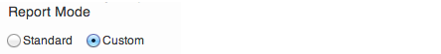
3.  Select all hostgroups.
    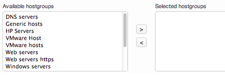
4.  Select Report period Since this is the first time we generate this report we use the last 31 days. When you use this on, for example, weekly basis you could use the last 7 days. 
5.   Select Summary type and set it to Top alert producers.
    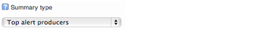
6.  Leave the Alert Types with the default value.
    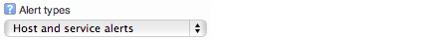
7.  Choose Hard states for State Types, we are only interested in the real problems.
     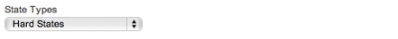
8.  Choose only problems sate for both hosts and services.
     
9.  Set the number of items to show in the resulting report. If you have a large environment with a lots of host you might want to increase the number of shown items.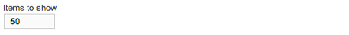
10. Click on **Show Report**.

## Top alert producers result

Now we have a report ready to be examined.
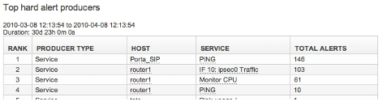
 This report can be used as a guide to help you to minimize the number of false alerts and notifications. Significant amounts of false alerts can lead to the users loosing faith in the monitoring system.

## Saving an Alert summary report

Alert summary reports are useful from time to time. So when you have created a new one you will probably like to use that one an other time. Then it is a good idea to save it.

### To save an Alert summary report.

 

1.  Create an Alert summary report like you did in [Creating a Top alert producers report](#Eventsandlogs-Creatingtopalertproducersreport), show the report then:
2.  Click **Save report**.
    
3.  Enter a name for the report and click **Create Summary Report**.

## Scheduling an Alert summary report

For the exact same reason as it is to schedule an availability report or a SLA report you might want to schedule an alert summary report.

### To schedule an alert summary report

1.  Create an Alert summary report like you did in [Creating top alert producers report](#Eventsandlogs-Creatingtopalertproducersreport) and save the report.
2.  Click the plus icon at the right top of the page
    
3.  Follow the instructions in [Schedule reports](Reports_16482315.html#Reports-schedule_reports), just select "Alert summary report" as report type.
     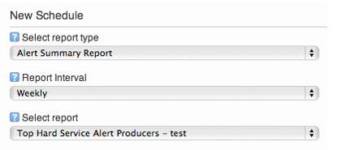
4.  Click **Save**.

 

# Trends

Trends display a graphic view of status on a host or a service during a selected time period. This graphical view is reached from Availability reports.

## Creating a trend report

 

1.  Click **Include trends graph**.
    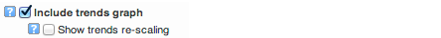
2.  The trends will be shown in the report.
    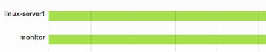

# Event log

An event log displays a list of all events that has occurred in op5 Monitor. It shows you everything from alerts and notifications to op5 Monitor service restarting. In other words this is a log viewer for the main op5 Monitor log.

## Viewing and filtering logs

In the op5 Monitor event log you can
 view every event that took place in op5 Monitor
 filter out any kind of events you do not want to see
 set the start and end time of the logs you like to view.

### To view the event log

Click the Event log icon in the main menu and there you go.

As you can see in the picture below everything except for **Initial and logrotation states** are shown by default.
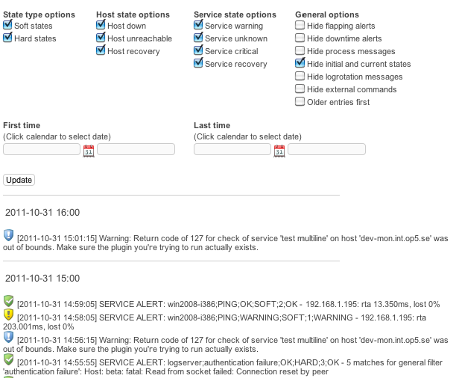

The event log view is divided into two parts

-   filtering
-   logs

 

In the filtering you can change what type of events you like to show and also between what dates you would like to view logs for.
 The logs are grouped by hours to make it a bit easier to find what you are looking for.

# Alert History

The alert history view is a view for all alerts that has been detected by the system.

## Viewing and filtering logs

In the op5 Monitor alert history you can

-   -   view every alert that took place in op5 Monitor
    -   filter out any kind of alerts you do not want to see
    -   set the start and end time of the alerts you like to view.

### To view the alert history

Click Alert history icon in the main menu, and you see an unfiltered list of alerts.

### Filter alert history

The list can be long. Try applying a filter to it by using the filter options. You can access them through the **Edit** settings icon.

 In the appearing dialog you can filter you alert history view.
 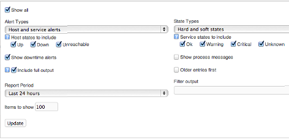
 By checking the check box **Show all** it is possible to filter the view on hostgroups, hosts, services and servicegroups as well.
 Select the checkbox **Include full output** to get the status information from the check in the alert histry as well.

