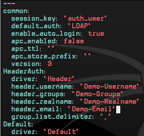

# Header\_auth\_SSO

# Introduction

Header Authentication can be used to give single sign on (SSO) access to OP5 Monitor by sending extra headers with the HTTP request. The headers must be sent on every page load, which means performing the authentication every time you load a page.

This authentication method should only be used when all requests are made through an authenticating proxy that filters all request headers. Failing to do this will enable any user to send extra headers that can grant admin privileges.

**Table of Contents**

-   [Introduction](#Header_auth_SSO-Introduction)
-   [Configuration](#Header_auth_SSO-Configuration)
-   [Permissions](#Header_auth_SSO-Permissions)

# Configuration

It's possible to enable HTTP header authentication by adding a authentication module using the "Header" driver. To configure this module, you need to add the following section to "/etc/op5/auth.yml". Note that "X-Username", "X-Realname", "X-Email", and "X-Groups" are the corresponding and case-insensitive headers. Additionally, you must set the "enable\_auto\_login" option to "true" for header authentication work:

``` {.text data-syntaxhighlighter-params="brush: text; gutter: false; theme: Confluence" data-theme="Confluence" style="brush: text; gutter: false; theme: Confluence"}
HeaderAuth:
  driver: "Header"
  header_username: X-Username
  header_realname: X-Realname
  header_email: X-Email
  header_groups: X-Groups
  group_list_delimiter: ","
```

Below is an example configuration of the authentication module in Monitor (from "/etc/op5/auth.yml"): 



# Permissions

Permissions are handled by the groups that are sent in the group header, which can be configured on the "[Group permissions](https://kb.op5.com/display/HOWTOs/How+to+add+a+user+with+limited+visibility)" page.

