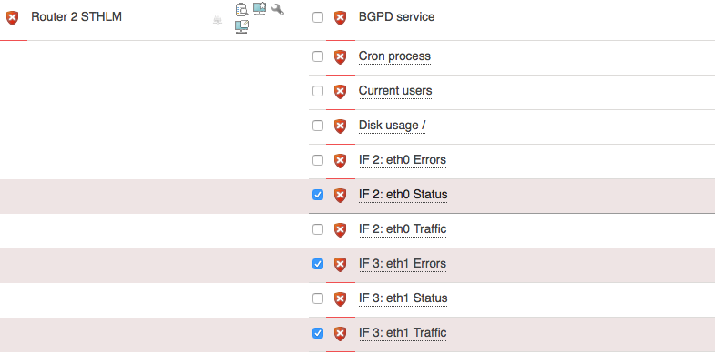
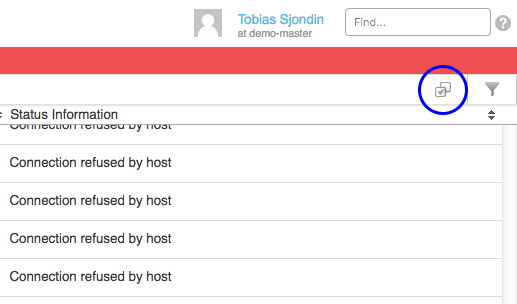
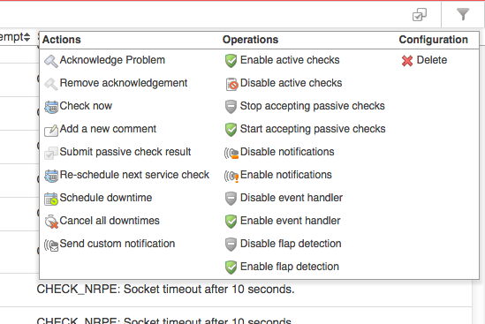
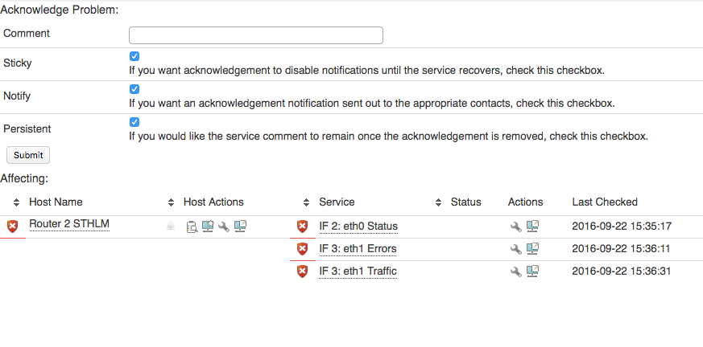

# Multiple host and service commands

# About

Multiple commands are used to apply a single command to one or more objects at the same time.

In lists of objects (such as host and service list views) that have commands you may perform commands on multiple objects within the list at the same time. This is very useful if you, for instance, have a bigger problem with one or many services and you want to acknowledge all of them at once.

**Table of Content**

-   [About](#Multiplehostandservicecommands-About)
-   [Multiple host commands list](#Multiplehostandservicecommands-Multiplehostcommandslist)
-   [Multiple service commands list](#Multiplehostandservicecommands-Multipleservicecommandslist)
-   [Example](#Multiplehostandservicecommands-Example)
    -   [Execute multiple commands](#Multiplehostandservicecommands-Executemultiplecommands)

# Multiple host commands list

-   Schedule downtime
-   Cancel Scheduled downtime
-   Acknowledge
-   Remove problem acknowledgement
-   Disable host notifications
-   Enable host notifications
-   Disable notifications for all services
-   Disable Active checks
-   Enable Active checks
-   Reschedule host check
-   Add host comment
-   Delete host

# Multiple service commands list

-   Schedule downtime
-   Cancel Scheduled downtime
-   Acknowledge
-   Remove problem acknowledgement
-   Disable service notifications
-   Enable service notifications
-   Disable Active checks
-   Enable Active checks
-   Reschedule service check
-   Add service comment
-   Delete Service(s)

# Example

In this example we will send acknowledgements to multiple services.

## Execute multiple commands

Open up **Unhandled problems** filter under the filter menu.
 

Select the services problems you like to acknowledge.

Click the **Send multi action** icon below the search field.

The multi action menu is located on top of every listview, on the far right side of the screen.

 Chose **Acknowledge Problem** in the **Multi action** menu.
 

 

Type in a comment and click **Submit**.

