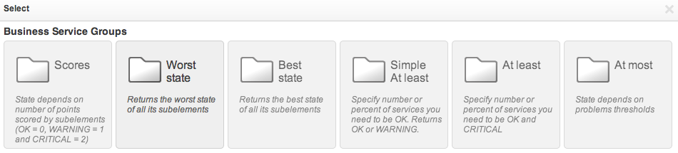
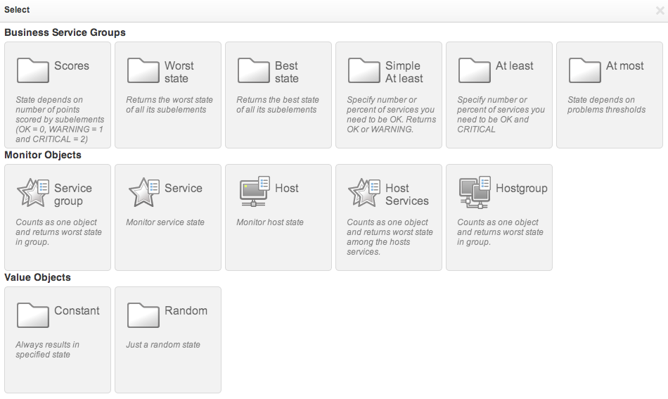
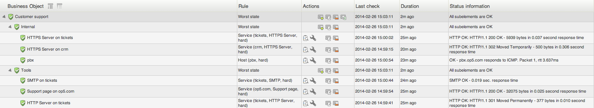
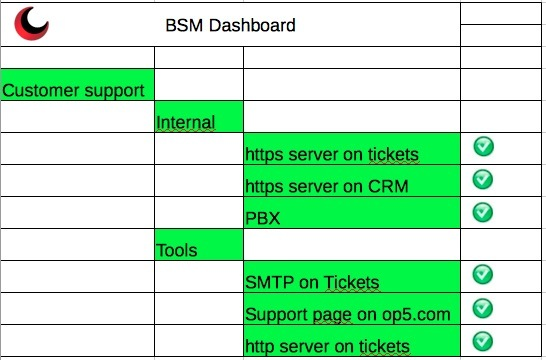

# 4 steps to turn on simple BSM in your system

Whitepaper: How to build a business service management bridge between it and business

Business service management (BSM) is about bridging the gap between IT operations and the business. In essence creating an understanding the impact an IT related problem will have on the business. This solution brief details how you can implement BSM logic and generate rules sets to increase the understanding between IT and business. [Download the whitepaper](images/5376342/5734800.pdf)

## 1 - Identify IT services for your organization

Start by writing down the services your team delivers today to your organization and/or customers on a piece of paper, for this example we will create a BSM-service for "Customer support". Customer support as a team have multiple tools at their disposal to deliver the service so we write them down as well and group them by accessibility for example, Online for online resources and Tools for internal supporting tools such as Trouble ticket systems and CRM systems etc.

Common tools and services can be reused in multiple levels of your BSM-tree

## 2 - Visualize the BSM-services you plan to create

We are still using a pen and paper here so try to visualize the chain, this will help you later to decide how downtime or any issues impacts your service.

- Customer Support
  - Online
  - Official webpage (contact information)
  - Trouble ticket system
  - Mail
  - IP Telephony
  - Tools
  - Trouble ticket system
  - CRM

Try to limit number of levels used unless you have a complex dependency chain for critical services, aim for 1-2 levels to start with.

## 3 - Use what you already monitor

Build your BSM-services by using existing monitoring metrics for the systems you wrote down in step 1.

First create the top level object to mirror what you visualized in step 2 and select "worst state". This means that if any child-objects has any alarm-state this will also be the case for "this" object.

Next add the second level and in this case this is Online and Tools also configured as "worst state" (for other options or rules please see our manual).

The metrics you use should cover both availability and performance, for example if you monitor HTTP-request towards the Trouble ticket system to see if the server responds as it should for normal HTTP-traffic you probably also want to add something to alert if things are getting slow such as sign-in session timeouts or high system load. Add additional objects as the previous screenshot but use "Service" to browse for the services you want to add.

At this stage you probably found out that you haven't checks for everything you want included in your BSM-service. Add any additional monitoring metrics and include them as well, and if you didn't and everything was already in place you are in good shape!

When you are done adding you services it should look like something like this:

## 4 - Visualize for everybody!

Below are a few screenshots to give inspiration on what you can do to visualize your BSM-services on dashboards and big screens using Nagvis in OP5 Monitor. Sky is the limit here. Popular choices are Visio-diagrams and also as simple as creating a spreadsheet to use as background as seen below:

This is from one of our users who published this really nice idea for a dashboard on twitter (source)

**Get in touch to learn more about Business Service Management**
