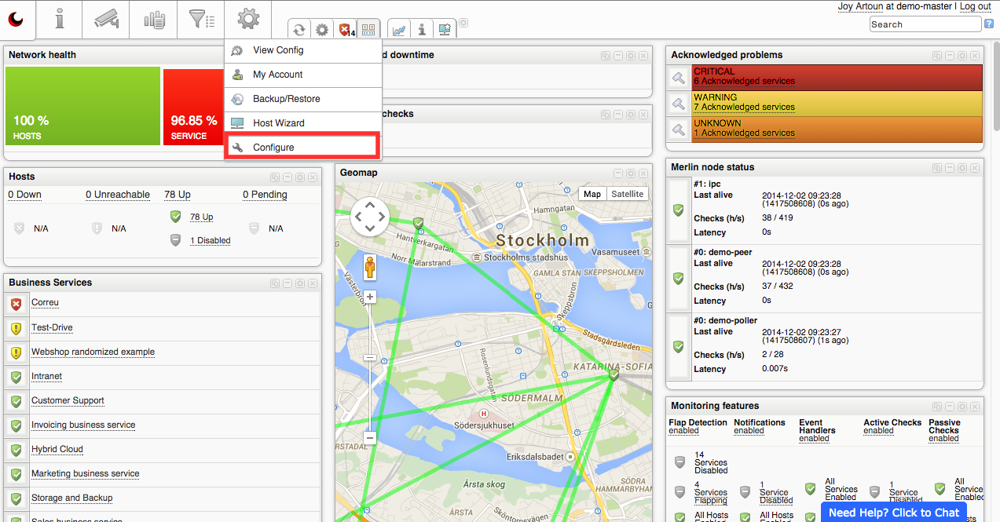
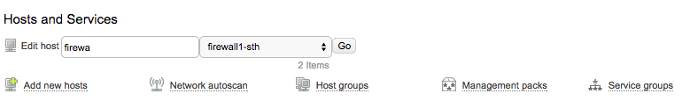
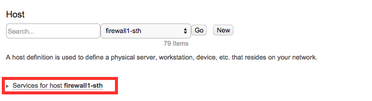
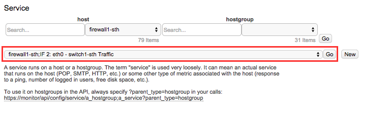
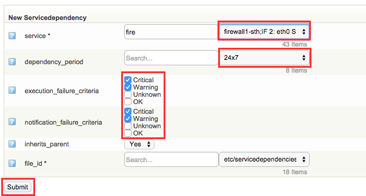
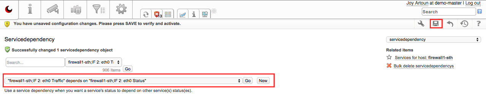

# Add a service dependency

# Why would you want to do this?

Sometimes you want to have dependencies on certain services. For example some network traffic is dependent on that a certain port is up and configured correctly. Or maybe a shared disk you are monitoring is dependent on that the SAN is up and working. If the port is down you probably only want a notification from the port status and not about the traffic as well. And you don't want a notification about the shared disk if the SAN is not working correctly.

# Choosing the service that is going to be dependent on another service

Go to Configure

Choose the host in which the service is set on.

And click Go

Go to services for host [host]

Choose the service from the drop down menu and click "go"

Click on Dependencies

At the top bar you see the service which will be dependent on another service.

At the New Servicedependency page, choose the service that you want to depend on.

Choose the dependency period.

You can edit what kind of failure criteria that is necessary for the dependency to work.

Click Submit.

Now you see that the service you chose from the beginning is dependent on the service dependency you edited right now.

Save your work.

# Word of advice

- Remember that adding a service dependency on a host group service will result in all hosts in that host group inherits the service dependency. The dependancy is added to all hosts in the same host group.
- Be very cautious when adding a service dependency, be sure that it is the right service and the right hosts are involved. For example, in this howto we wouldn't want the service "IF 2 eth0 Traffic" to be dependent on **another** switch's "IF 2 eth0 status".
