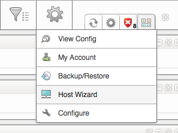
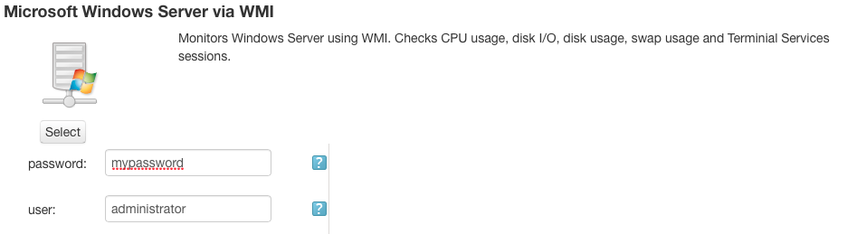
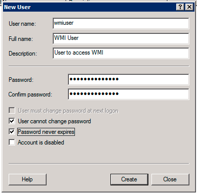
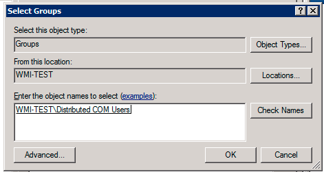
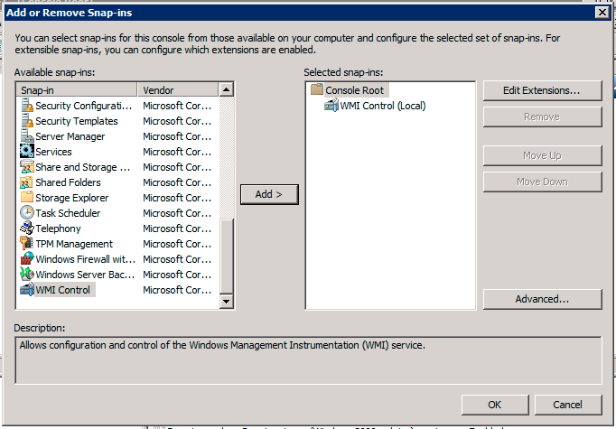
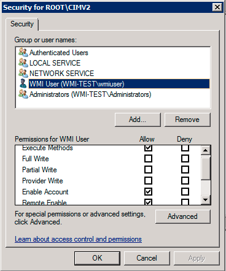
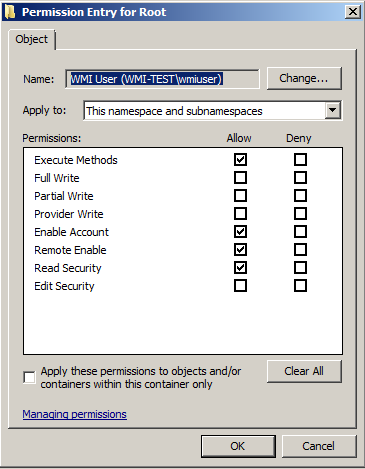
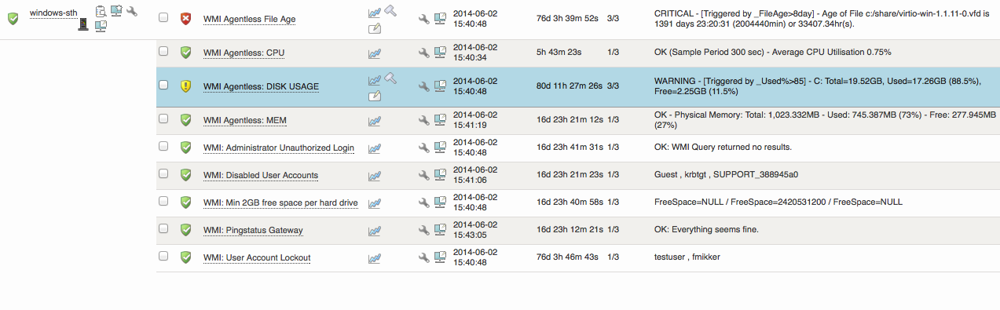

# Agentless Monitoring of Windows using WMI

## Introduction

This how-to will guide you to monitor your Windows server using WMI.
This will allow you to monitor Windows hosts without installing an agent.

WMI monitoring should be used only when it's not possible to use the agent.

## Contents

- [Introduction](#AgentlessMonitoringofWindowsusingWMI-Introduction)
- [Contents](#AgentlessMonitoringofWindowsusingWMI-Contents)
- [Information about WMI](#AgentlessMonitoringofWindowsusingWMI-InformationaboutWMI)
  - [What is WMI?](#AgentlessMonitoringofWindowsusingWMI-WhatisWMI?)
  - [Why should I use WMI?](#AgentlessMonitoringofWindowsusingWMI-WhyshouldIuseWMI?)
- [Prerequisites](#AgentlessMonitoringofWindowsusingWMI-Prerequisites)
- [Start monitoring](#AgentlessMonitoringofWindowsusingWMI-Startmonitoring)
  - [Add a new host using Management packs](#AgentlessMonitoringofWindowsusingWMI-AddanewhostusingManagementpacks)
  - [Usage examples](#AgentlessMonitoringofWindowsusingWMI-Usageexamples)
  - [Monitoring all system services ](#AgentlessMonitoringofWindowsusingWMI-Monitoringallsystemservices)
  - [Monitoring specific system service](#AgentlessMonitoringofWindowsusingWMI-Monitoringspecificsystemservice)
- [Troubleshooting and testing](#AgentlessMonitoringofWindowsusingWMI-Troubleshootingandtesting)
  - [Manually test the check\_wmi\_plus plugin](#AgentlessMonitoringofWindowsusingWMI-Manuallytestthecheck_wmi_plusplugin)
  - [Configure WMI account information](#AgentlessMonitoringofWindowsusingWMI-ConfigureWMIaccountinformation)
- [Configure remote WMI access in Windows](#AgentlessMonitoringofWindowsusingWMI-ConfigureremoteWMIaccessinWindows)
  - [Create a new user](#AgentlessMonitoringofWindowsusingWMI-Createanewuser)
  - [Change user settings](#AgentlessMonitoringofWindowsusingWMI-Changeusersettings)
  - [Grant privileges to WMI](#AgentlessMonitoringofWindowsusingWMI-GrantprivilegestoWMI)
- [How does it look like in monitor?](#AgentlessMonitoringofWindowsusingWMI-Howdoesitlooklikeinmonitor?)

[OP5 Monitor: Open Source Network Monitoring](#AgentlessMonitoringofWindowsusingWMI-OP5Monitor:OpenSourceNetworkMonitoring)

- [Download OP5 Monitor Free](#AgentlessMonitoringofWindowsusingWMI-Downloadop5MonitorFree)

## Information about WMI

### What is WMI?

In short: A way to do queries on a Windows host, much like SNMP but much more advanced.
The Long version: WMI is a set of extensions to the Windows Driver Model that provides an operating system interface through which instrumented components provide information and notification.
WMI is Microsoft’s implementation of the Web-Based Enterprise Management ([WBEM](http://en.wikipedia.org/wiki/Web-Based_Enterprise_Management)) and Common Information Model ([CIM](http://en.wikipedia.org/wiki/Common_Information_Model_(computing))) standards from the Distributed Management Task Force ([DMTF](http://en.wikipedia.org/wiki/Distributed_Management_Task_Force)) (source: [Wikipedia](http://www.wikipedia.org/)).

### Why should I use WMI?

1. It is agentless
2. You can monitor a lot more with WMI on Windows host than with SNMP
3. You can create more complex monitoring queries

## Prerequisites

- The Windows host you want to monitor needs to have WMI enabled and a system user that is allowed to do WMI queries (See "Configure remote WMI access in Windows" below)

## Start monitoring

### Add a new host using Management packs

1. Go to Configure -\> Host Wizard
    
2. Select the management pack "Microsoft Windows Server via WMI" and enter the credentials for a user with WMI query privileges
    
3. Click the **Next** button
4. Enter host name and IP address and click **Next**
5. Click on **Save configuration and view hosts**

### **Usage examples**

To start monitoring Windows system services you need to add a new service the your host in OP5 Monitor.
See the product [Manual](https://kb.op5.com/display/DOC/Managing+objects#Managingobjects-adding-serviceAddingaservice) for more information regarding service configuration.

#### Monitoring all system services

1. Expand "check\_command" and select "check\_wmip\_service" in the drop-down list

2. Set "check\_command\_args" to "\$\_HOSTUSER\$!\$\_HOSTPASSWORD\$!Auto"

    You can add a forth argument with a pipe ("|") separated list containing services that you want to exclude from monitoring.
    Example: "\$\_HOSTUSER\$!\$\_HOSTPASSWORD\$!Auto!service\_a|service\_b\_|service\_c"

3. Click on the "Submit" button and then "Save changes" in the top right corner

#### Monitoring specific system service

1. Expand "check\_command" and select "check\_wmip\_service" in the drop-down list

2. Set "check\_command\_args" to "\$\_HOSTUSER\$!\$\_HOSTPASSWORD\$!service\_name"

    The third argument specifying service name can be a pipe ("|") separated list containing of services.
    Example: "\$\_HOSTUSER\$!\$\_HOSTPASSWORD\$!service\_a|service\_b"

3. Click on the "Submit" button and then "Save changes" in the top right corner

## Troubleshooting and testing

### Manually test the check\_wmi\_plus plugin

Execute the following command via SSH or console on the server running OP5 Monitor:

``` {.text data-syntaxhighlighter-params="brush: text; gutter: false; theme: Confluence" data-theme="Confluence" style="brush: text; gutter: false; theme: Confluence"}
# asmonitor /opt/plugins/check_wmi_plus.pl -H [IP or Hostname] -u [username] -p [password] -m checkmem -w 80 -c 90
```

In some cases UPN (user@domain) might be used instead of DOMAIN/USE

Security

### Configure WMI account information

It’s possible to add user and password to a central file “`/opt/monitor/etc/resource.cfg`”.

This allows you to partially hide the credentials from the OP5 GUI and to update a single file if they need to be updated.
Note that you need to edit all of the WMI `check_command` to use `$USER8$` and `$USER9$` instead of` $ARG1$` and `$ARG2$`.
You will also have to rename the remaining arguments.

Example of an updated check\_command:

``` {.text data-syntaxhighlighter-params="brush: text; gutter: false; theme: Confluence" data-theme="Confluence" style="brush: text; gutter: false; theme: Confluence"}
$USER1$/check_wmi_plus.pl -H $HOSTADDRESS$ -m checkcpu -u $USER8$ -p $USER9$ -w $ARG1$ -c $ARG2$ $ARG3$ $ARG4$ $ARG5$
```

    If you wish to use the resource file, add the following to “/opt/monitor/etc/resource.cfg”:

``` {.text data-syntaxhighlighter-params="brush: text; gutter: false; theme: Confluence" data-theme="Confluence" style="brush: text; gutter: false; theme: Confluence"}
$USER8$=[wmi username]
$USER9$=[wmi password]
```

Restart the monitor service via SSH or console on the OP5 Monitor server:

``` {.text data-syntaxhighlighter-params="brush: text; gutter: false; theme: Confluence" data-theme="Confluence" style="brush: text; gutter: false; theme: Confluence"}
# service monitor restart
```

## Configure remote WMI access in Windows

There are two way to grant access to WMI for a remote user, either you add a user to the administrators group or you follow the steps below to grant access to WMI without using administrator rights.

When using a non-administrator user it is not possible to monitor all Windows services.
Some services require that some security settings in Windows is modified which is out of scoop for this how-to.

This part shows how to set up remote WMI access on a Windows 2008 R2 SP1 server. This server was set up as a member server of a workgroup.

### Create a new user

We create a new user and after that we will give the user access to do remote WMI queries.

- Go to ‘Server Manager’ by right-clicking on ‘Computer’ in the start-menu and select ‘Manage’
- Click your way down to Configuration -\> Local Users and Groups -\> Users
- Create a new user.
- Set ‘User Name’ to any name you like.
- Check ‘User cannot change password’
- Check ‘Password never expires’
- Click ‘Create’



### Change user settings

- Edit the user just created and go to the tab ‘Members of’
- Click add and add the group ‘Distributed COM Users’



- Click ‘OK’
- Also add the group ‘Perfomance log users’
- Remove group ‘User’
- Click ‘OK’

### Grant privileges to WMI

- Open ‘MMC’ by going to start-menu and runt the command ‘mmc’
- Go to File -\> Add/Remove Snap-in…’
- Add ‘WMI Control’ for the local computer



- Click ‘OK’
- Right-click on ‘WMI Control (local)’ in the right hand list and select ‘Properties’
- Go to the ‘Security’ tab
- Select ‘Root’ and click on ‘Security’
- Add the user earlier created and set the following permissions:
  - Execute methods
  - Enable Account
  - Remote Enable



- Click on ‘Advanced’
- Select the WMI user and click on ‘Edit’
- Select to apply this to ‘This namespace and subnamespaces’



- Click ‘OK’ four times.

Done!

## How does it look like in monitor?



Read more

[WMI browser](http://www.ks-soft.net/hostmon.eng/wmi/index.htm)
[Check WMI Plus homepage](http://www.edcint.co.nz/checkwmiplus)

# OP5 Monitor: Open Source Network Monitoring

[OP5 ](https://www.op5.com/)is the preferred Open Source Networking & Server Monitoring tool for large multi-national companies in over 60 markets. If you would like to experience OP5 Monitor you can get started here, alternatively, if you prefer to get more hands on you can Download OP5 Monitor for free.

### [Download OP5 Monitor Free](https://www.op5.com/download-op5-monitor/)

[](https://www.op5.com/download-op5-monitor/)
