# Certificate management for LDAP SSL (sldap) with Active Directory

Version

This article was written for version 7.0 of Monitor, it could work on both lower and higher version if nothing else is stated.

Articles in the Community-Space are not supported by OP5 Support.

This how-to will help you use LDAP SSL with AD authentication

- [Certificate management for LDAP SSL (sldap) with Active Directory](#certificate-management-for-ldap-ssl-sldap-with-active-directory)
- [Install Active Directory Certificate Services (AD CS)](#install-active-directory-certificate-services-ad-cs)
- [Export certificate to OP5 Monitor](#export-certificate-to-op5-monitor)
- [Import certificate in to OP5 Monitor](#import-certificate-in-to-op5-monitor)
- [Related information: TLS error -8179:Peer's Certificate issuer is not recognized](#related-information-tls-error--8179peers-certificate-issuer-is-not-recognized)

# Install Active Directory Certificate Services (AD CS)

To create a certificate, start with installing the *Active Directory Certificate Services* (AD CS) role if it is not already installed and create a root certificate.

1. Add a new server role

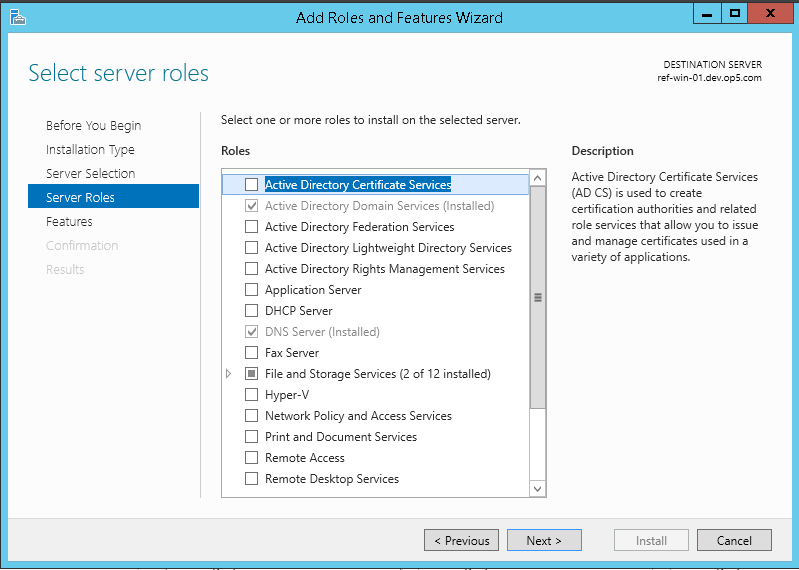 \


    Select "Active Directory Certificate Services" and click Next
2. Click "Add features"

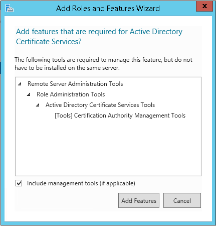 \


3. Click Next without selecting any features

 \


4. Click Next

 \


5. Select "Certification Authority" and click Next

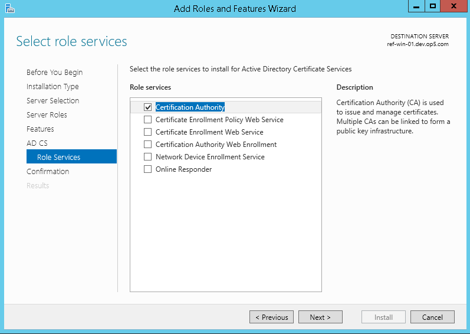 \


6. Click Install

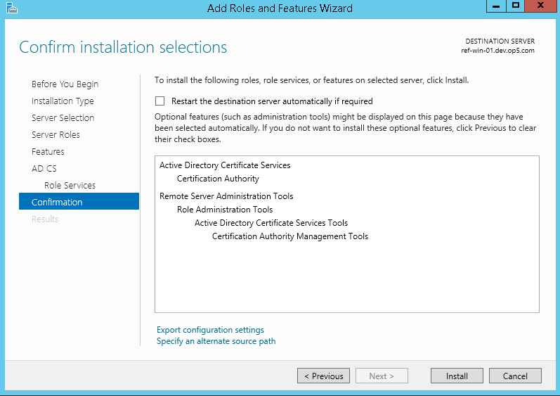 \


7. When the installation is complete you'll get a task to configure AD CS. Click the task to open the configuration wizard.

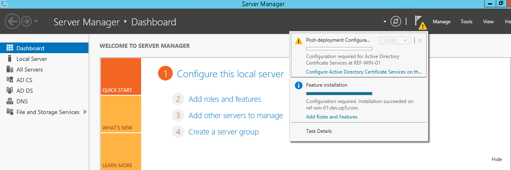 \


8. Click Next to use your current credentals

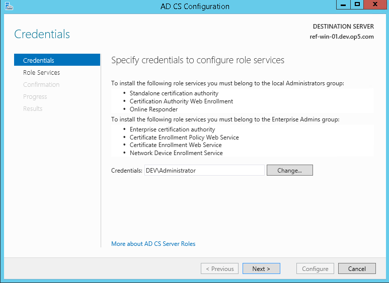 \


9. Click Next

 \


10. Click Next

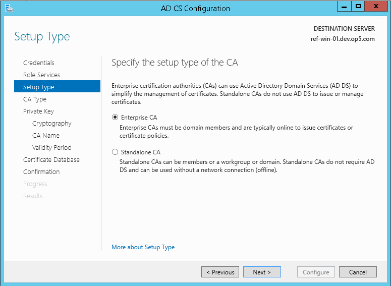 \


11. Click Next

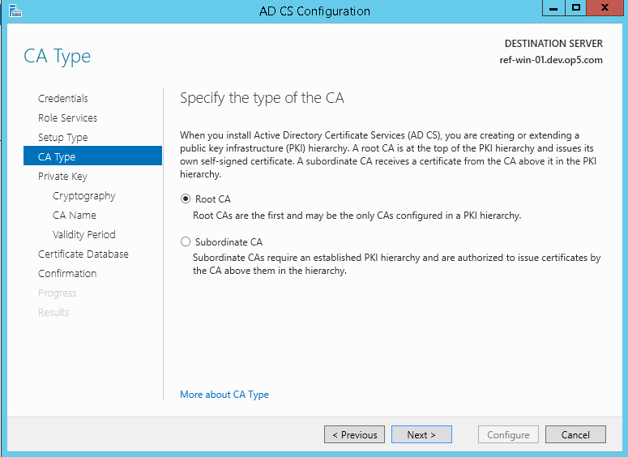 \


12. Click Next

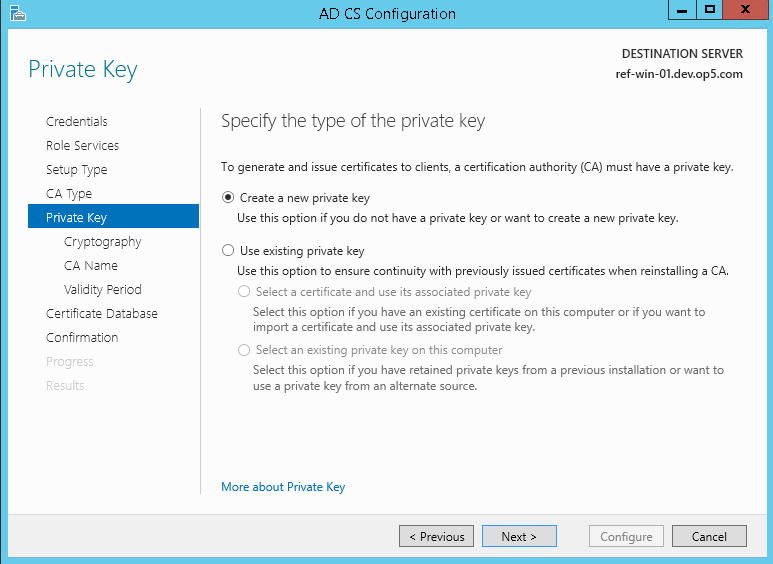 \


13. Select SHA256 (or the appropriate settings for your company's security policy)

 \


14. Click Next

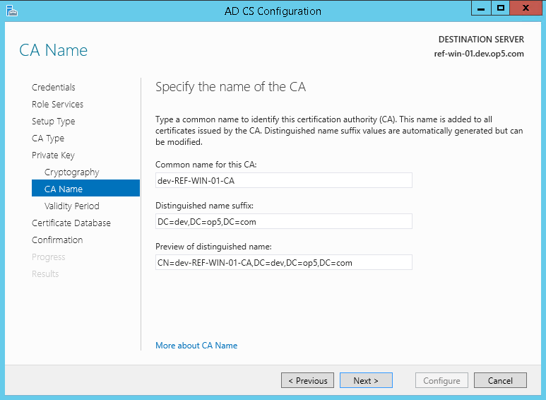 \


15. Click Next

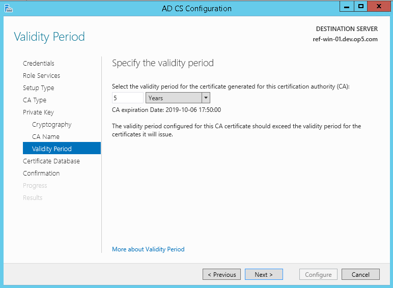 \


16. Click Next
17. Click Configure

# Export certificate to OP5 Monitor

In order for the OP5 Monitor server to verify the server's certificate, the public certificate is exported from the Windows server.

1. Run the following from the command prompt.

    ``` {.bash data-syntaxhighlighter-params="brush: bash; gutter: false; theme: Confluence" data-theme="Confluence" style="brush: bash; gutter: false; theme: Confluence"}
    certutil -ca.cert client.crt
    ```

2. Copy the exported file (client.cer) to the OP5 Monitor server.

# Import certificate in to OP5 Monitor

1. Install the certificate on the OP5 Monitor server by running:

    ``` {.bash data-syntaxhighlighter-params="brush: bash; gutter: false; theme: Confluence" data-theme="Confluence" style="brush: bash; gutter: false; theme: Confluence"}
    certutil -A -d /etc/openldap/certs/ -n ref-win-01 -t C -i /root/client.crt
    ```

    To verify that the certificate was installed, run:

    ``` {.bash data-syntaxhighlighter-params="brush: bash; gutter: false; theme: Confluence" data-theme="Confluence" style="brush: bash; gutter: false; theme: Confluence"}
    certutil -O -d /etc/openldap/certs/ -n ref-win-01
    ```

2. Make the certificate database readable by apache by running:

    ``` {.bash data-syntaxhighlighter-params="brush: bash; gutter: false; theme: Confluence" data-theme="Confluence" style="brush: bash; gutter: false; theme: Confluence"}
    chgrp apache /etc/openldap/certs/* && chmod g+r /etc/openldap/certs/*
    ```

3. Edit /etc/openldap/ldap.conf and add

    ``` {.bash data-syntaxhighlighter-params="brush: bash; gutter: false; theme: Confluence" data-theme="Confluence" style="brush: bash; gutter: false; theme: Confluence"}
    TLS_REQCERT allow
    ```

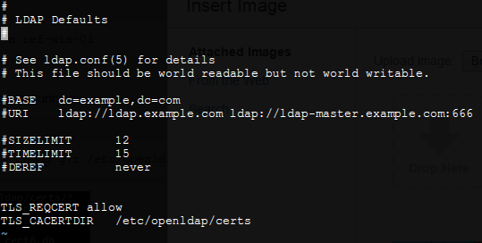 \


4. Restart apache by running:

    ``` {.bash data-syntaxhighlighter-params="brush: bash; gutter: false; theme: Confluence" data-theme="Confluence" style="brush: bash; gutter: false; theme: Confluence"}
    /etc/init.d/httpd stop && /etc/init.d/httpd start
    ```

The setting TLS\_REQCERT can also be set to the more secure setting "try" and "demand". See man ldap.conf for more information.

# Related information: TLS error -8179:Peer's Certificate issuer is not recognized

The steps provided in this document can serve to resolve the "8179:Peer's Certificate issuer is not recognized" error. Because it's likely to already have a root certificate for your domain, you can start at step titled "Export certificate to OP5 Monitor". Alternatively using the certificates snap-in MMC you can export the root certificate for your domain in der format, saving with .cer extension. Continuing afterward to complete the step "Import certificate in to OP5 Monitor" mentioned above.
