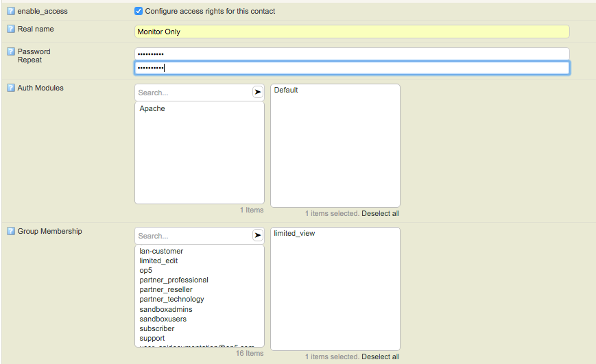

# How to add a user with limited visibility

-

[Introduction to Group Rights for limited visibility](#Howtoaddauserwithlimitedvisibility-IntroductiontoGroupRightsforlimitedvisibility)

[Create a user & assign limited visibility](#Howtoaddauserwithlimitedvisibility-Createauser&assignlimitedvisibility)

- [Step 1 - Add a contact](#Howtoaddauserwithlimitedvisibility-Step1-Addacontact)
- [Step 2 - (Optional) Create a user with access rights & group membership](#Howtoaddauserwithlimitedvisibility-Step2-(Optional)Createauserwithaccessrights&groupmembership)
- [Step 3 - Set the contact as a "contact" for hosts](#Howtoaddauserwithlimitedvisibility-Step3-Setthecontactasa"contact"forhosts)
- [Step 4 - Verify the user permissions](#Howtoaddauserwithlimitedvisibility-Step4-Verifytheuserpermissions)
- [Step 5 - (Optional) Limiting the menu items for specific groups](#Howtoaddauserwithlimitedvisibility-Step5-(Optional)Limitingthemenuitemsforspecificgroups)

# Introduction to Group Rights for limited visibility

In order to achieve limited visibility for specific users you will need to work with group right permissions. The good news is OP5 Monitor has predefined groups with limited permissions already. To view these, simply navigate to "configure -\> assign group rights" and expand the permission-set.

- admins
- default
- guest
- **limited\_edit**
- **limited\_view**

The group of your interest here is the "**limited\_view**" group, as this group has the following specific permissions set (see the screenshot below):

- Host - Host View Contact
- Service - Service View Contact
- Hostgroup - Hostgroup View Contact

These permissions define what permissions users in the "limited\_view" group has access to. It is clear that the permissions for "limited\_view" translates to: "Give this user read only access to host, services and host groups that the user is set as a contact for"

# Create a user & assign limited visibility

The steps below outline how to successfully add a user with limited visibility on specific hosts and with limited menu items.

## Step 1 - Add a contact

- Navigate to "configure -\> contacts" and create a new contact. REMEMBER: the contact\_name will be the username for login.
- Enter the required fields for the contact. If you enter the email address or pager (for GSM enabled monitoring) this user will receive notifications.
- **In this example we use the user "monitor\_only" but you can name your user however you prefer.**

## Step 2 - (Optional) Create a user with access rights & group membership

- Check the box "enable\_access" which will provide additional details about the contact. This step creates a "local" user for op5.
  - **REQUIRED:** Select the Auth Module **(Default, is typical)** and Group Membership **"limited\_view group"**.

Step 2 is not required if a user already exists, locally or in Active Directory or LDAP.

*Click Submit, then **also Save your changes.***

## Step 3 - Set the contact as a "**contact**" for hosts

Configure a host and set your newly created contact as a "contact":

Submit, and Save your changes.

## Step 4 - Verify the user permissions

Now logout and login as the user **monitor\_only** and you should only see the hosts you have assigned user monitor\_only as a contact to.

## Step 5 - (Optional) Limiting the menu items for specific groups

You can also limited the menu items available to specific groups by following these few steps.

- Login as an "Admin" level user. Click your username in the upper right hand corner.

- Click "edit user menu"

- Select the group in this case "limited\_view". Check the boxes for items you wish this group to have access to.
- **REMEMBER:** The features you select will only allow the users to view what you have given the access to specifically.
