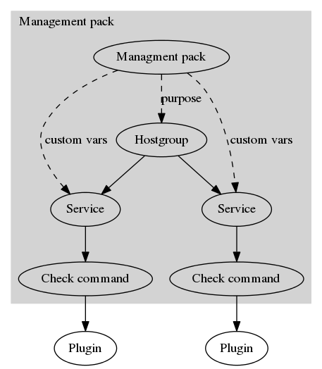
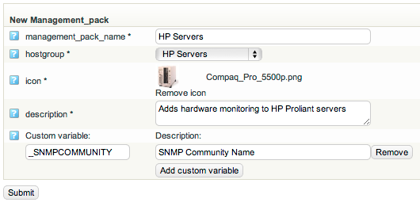
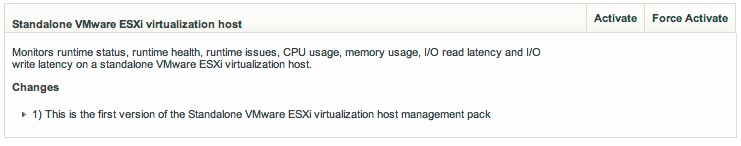
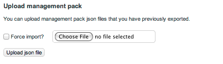

# How to create a management pack

This is an abstraction from the [op5 admin manual](http://goo.gl/1aUa3A), for further details please see the full manual.

 

A management pack is essentially a group of services connected to a hostgroup with the possibility to add custom variables. These are then used by the Host Wizard.

The benefit with using management packs is that the monitoring will be more homogeneous.

The picture below shows how management packs integrates into OP5 Monitor.

#### Creating management packs

To create a management pack a hostgroup must be created and the services that should be included in the management pack should be added to that hostgroup. See Services on Host groups [on page 44](https://www.op5.com/manuals/op5_Monitor_Administrator_Manual/op5_monitor_configuration_tool.html#ww1252502 "Monitoring objects configuration") for more information.

After the hostgroup with services has been created the hostgroup can be converted into a management pack.

To create a new management pack from a hostgroup go to Management Packs in the configuration.

1.  Enter a name for the management pack.
2.  Select which hostgroup that should be used for the management pack.
3.  Select an icon (a larger icon looks better in the host wizard).
4.  Enter a description.

It is also possible to add custom variables, these can be used for information that needs to be entered when using the host wizard. Such as username, password and SNMP community names.

In this example we create a management pack for HP Servers with one custom variable for SNMP community name.

Click on Submit to save the management pack.

#### Group in Group with Management Packs

It is possible to use the group in group with management packs. This works in the same way as it does for normal hostgroups.

##### Example

The hostgroup fruits includes the hostgroup ‘apples’.

If a management pack is associated with ‘fruits’ will the host be added to the hostgroup ‘fruits’ and it will get all the services that are on the hostgroup ‘fruits’, but it will not be affected by the ‘apples’ hostgroup.

If a management pack is associated with apples the host will be added to the hostgroup apples and get all the services that are in the hostgroup ‘apples’ AND all the services that are in the hostgroup ‘fruits’.

More concrete; 
A hostgroup ‘linux’ is created with the check ‘check\_ssh\_cpu’ 
A hostgroup ‘generic’ is created with the check ‘check\_ping’

Management pack ‘generic server’ is associated with the hostgroup ‘generic’. Hosts that are added with the management pack ‘generic server’ will get the ‘check\_ping’ service.

Mangement pack ‘linux servers’ is associated with the hostgroup ‘linux’. Hosts added with the ‘linux servers’ will get both the ‘check\_ssh\_cpu’ and the ‘check\_ping’ checks.

#### Activate Management Packs

Management packs that are not created by the user, provided by OP5 or a third party, need to be activated.

To activate a management pack go to Management Pack Management in the configuration.

Click on **Activate** to activate a management pack.

Force Activate will override any management pack with the same name.

#### Import Management Packs

To import a management pack from a json-file go to Management Pack Management.

Click on Choose File to select the json-file that should be imported.

Click on Upload json file to import the management pack.

#### Export Management Packs

Export management packs makes it possible to share your management pack with others or upload it to another OP5 Monitor server.

Go to Management Pack Management under configuration.

Click on Export on the management pack to export this to a json-file. The file will be downloaded to you computer.

 

