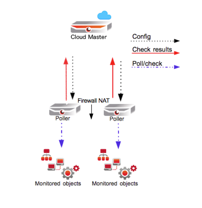

# How to use Merlin in NAT networks

Information

This article was written for version 6.3.0.1 of OP5 Monitor, it could work on both lower and higher version if nothing else is stated.

This article does not include configuration of iptables (firewall) though it is recommended to use it. In this article iptables is disabled.

Articles in the Community-Space are not supported by OP5 Support.

# Introduction

When configuring distributed monitoring you sometimes want to tunnel the traffic between the peers/pollers and use a [virtual private network](http://en.wikipedia.org/wiki/Virtual_private_network)(VPN). This can be useful in a scenario where one of the peers/pollers is behind NAT and isn't directly accessible.
This can be done by installing and configuring [OpenVPN](http://en.wikipedia.org/wiki/OpenVPN) on the peers/pollers. OpenVPN uses [OpenSSL](http://en.wikipedia.org/wiki/Openssl) to encrypt the traffic being exchanged between the devices. In this how to we will go through a scenario that can exist in real life.

# Prerequisites

- Connection to the Internet
- Updated operating system
- Basic Linux/Unix knowledge. How to install packages, ssh, scp, copy files, execute scripts, read files, edit files, stop and start services.

# Topology

 \


In this scenario we have a Internet accessible monitor server. This master has to be able to reach the pollers that are behind a firewall configured with NAT ([Network Address Translation](http://en.wikipedia.org/wiki/Network_address_translation)). This creates an issue when reaching the pollers. The master can not pass by the firewall and reach the internal pollers and simultaneously differentiate between them. The master sees one public IP address to the pollers.

# Configure OpenVPN server on Master

- Enable epel repository

    ``` {.bash data-syntaxhighlighter-params="brush: bash; gutter: false; theme: Confluence" data-theme="Confluence" style="brush: bash; gutter: false; theme: Confluence"}
    # rpm -Uvh http://dl.fedoraproject.org/pub/epel/6/x86_64/epel-release-6-8.noarch.rpm
    ```

- Install `openvpn` and `easy-rsa`

    ``` {.bash data-syntaxhighlighter-params="brush: bash; gutter: false; theme: Confluence" data-theme="Confluence" style="brush: bash; gutter: false; theme: Confluence"}
    # yum install -y openvpn easy-rsa
    ```

- Copy a sample `server.conf` file to `/etc/openvpn`

    ``` {.bash data-syntaxhighlighter-params="brush: bash; gutter: false; theme: Confluence" data-theme="Confluence" style="brush: bash; gutter: false; theme: Confluence"}
    # cp /usr/share/doc/openvpn-*/sample/sample-config-files/server.conf /etc/openvpn
    ```

- Edit `/etc/server.conf` and uncomment and change these lines as shown below:

    ``` {.bash data-syntaxhighlighter-params="brush: bash; gutter: false; theme: Confluence" data-theme="Confluence" style="brush: bash; gutter: false; theme: Confluence"}
    # vim /etc/openvpn/server.conf
    ```

     push "redirect-gateway def bypass-dhcp" push "dhcp-option DNS 8.8.8.8" (Could be another ip, DNS server must be able to reach internet) push "dhcp-option DNS 8.8.4.4" (Could be another ip, DNS server must be able to reach internet) dh dh2048.pem user nobody group nobody

- Make a directory in `/etc/openvpn` called `easy-rsa` and copy config-files to it

    ``` {.bash data-syntaxhighlighter-params="brush: bash; gutter: false; theme: Confluence" data-theme="Confluence" style="brush: bash; gutter: false; theme: Confluence"}
    # mkdir -p /etc/openvpn/easy-rsa/keys
    # cp -rf /usr/share/easy-rsa/2.0/* /etc/openvpn/easy-rsa
    ```

- Edit /etc/openvpn/easy-rsa/vars file and change the following values. Note that these are only examples, change this to fit your environment.

    ``` {.bash data-syntaxhighlighter-params="brush: bash; gutter: false; theme: Confluence" data-theme="Confluence" style="brush: bash; gutter: false; theme: Confluence"}
    # vim /etc/openvpn/easy-rsa/vars
    ```

    export KEY\_COUNTRY="SE"export KEY\_PROVINCE="Stockholm"export KEY\_CITY="Stockholm"export KEY\_ORG="DummyCompany AB"export KEY\_EMAIL="support@`dummycompany.org`"export KEY\_OU="ProfessionalServices"export KEY\_CN="master.dummycompany.com"

    ` `

- Copy and rename `/etc/openvpn/easy-rsa/openssl-1.0.0.cnf `to` /etc/openvpn/easy-rsa/openssl.cnf`

    ``` {.bash data-syntaxhighlighter-params="brush: bash; gutter: false; theme: Confluence" data-theme="Confluence" style="brush: bash; gutter: false; theme: Confluence"}
    # cp /etc/openvpn/easy-rsa/openssl-1.0.0.cnf /etc/openvpn/easy-rsa/openssl.cnf
    ```

    ` `

- ` Change directory and source the file `/etc/openvpn/easy-rsa/vars and start building certificates and keys.

    ``` {.bash data-syntaxhighlighter-params="brush: bash; gutter: false; theme: Confluence" data-theme="Confluence" style="brush: bash; gutter: false; theme: Confluence"}
    # cd /etc/openvpn/easy-rsa
    # source ./vars
    # ./clean-all
    # ./build-ca
    ```

    Answer yes to all.

- Build a key

    ``` {.bash data-syntaxhighlighter-params="brush: bash; gutter: false; theme: Confluence" data-theme="Confluence" style="brush: bash; gutter: false; theme: Confluence"}
    # ./build-key-server server
    ```

    Answer yes to all, when prompted for password press enter, when promoted for y/n enter "y" and press enter.

- Generate Diffie Hellman key and copy the created keys and certificates to `/etc/openvpn`

    ``` {.bash data-syntaxhighlighter-params="brush: bash; gutter: false; theme: Confluence" data-theme="Confluence" style="brush: bash; gutter: false; theme: Confluence"}
    # ./build-dh
    # cd /etc/openvpn/easy-rsa/keys
    # cp dh2048.pem ca.crt server.crt server.key /etc/openvpn
    ```

- Build keys for all clients (pollers). The file /etc/openvpn/easy-rsa/vars needs to be edited to reflect the client and then sourced again.

    ``` {.bash data-syntaxhighlighter-params="brush: bash; gutter: false; theme: Confluence" data-theme="Confluence" style="brush: bash; gutter: false; theme: Confluence"}
    # vim /etc/openvpn/easy-rsa/vars
    ```

    `export KEY_CN="poller01.op5.com" `Save and exit

    ``` {.bash data-syntaxhighlighter-params="brush: bash; gutter: false; theme: Confluence" data-theme="Confluence" style="brush: bash; gutter: false; theme: Confluence"}
    # cd /etc/openvpn/easy-rsa
    # source ./vars
    # ./build-key poller01
    ```

    Answer yes to all, when prompted for password press enter, when promoted for y/n enter "y" and press enter.Copy the generated keys to the remote clients(pollers) root directory. You can choose how to do this but keep in mind that the keys must be well protected. ``The keys that need to be copied are in` /etc/openvpn/easy-rsa/keys:ca.crtpoller01.crtpoller01.key`Repeat this step for all your pollers.` `

- Allow ip forwarding by editing /etc/sysctl.conf:

    ``` {.bash data-syntaxhighlighter-params="brush: bash; gutter: false; theme: Confluence" data-theme="Confluence" style="brush: bash; gutter: false; theme: Confluence"}
    # vim /etc/sysctl.conf
    ```

    `net.ipv4.ip_forward = 1`
    Save and exit

    ``` {.bash data-syntaxhighlighter-params="brush: bash; gutter: false; theme: Confluence" data-theme="Confluence" style="brush: bash; gutter: false; theme: Confluence"}
    # sysctl -p
    ```

- Start OpenVPN and make it start at boot

    ``` {.bash data-syntaxhighlighter-params="brush: bash; gutter: false; theme: Confluence" data-theme="Confluence" style="brush: bash; gutter: false; theme: Confluence"}
     # service openvpn start
     # chkconfig openvpn on
    ```

- Verify that the tun0 interface exists

    ``` {.bash data-syntaxhighlighter-params="brush: bash; gutter: false; theme: Confluence" data-theme="Confluence" style="brush: bash; gutter: false; theme: Confluence"}
    # ifconfig
    tun0      Link encap:UNSPEC  HWaddr 00-00-00-00-00-00-00-00-00-00-00-00-00-00-00-00
              inet addr:10.8.0.1  P-t-P:10.8.0.2  Mask:255.255.255.255
              UP POINTOPOINT RUNNING NOARP MULTICAST  MTU:1500  Metric:1
              RX packets:18085 errors:0 dropped:0 overruns:0 frame:0
              TX packets:18180 errors:0 dropped:0 overruns:0 carrier:0
              collisions:0 txqueuelen:100
              RX bytes:4244728 (4.0 MiB)  TX bytes:2421496 (2.3 MiB)
    ```

- Remove the epel repository if you haven't been using it before this how to.

    ``` {.bash data-syntaxhighlighter-params="brush: bash; gutter: false; theme: Confluence" data-theme="Confluence" style="brush: bash; gutter: false; theme: Confluence"}
    # rm -f /etc/yum.repos.d/epel-*
    ```

# Configuring OpenVPN client on pollers

- Enable epel repository

    ``` {.bash data-syntaxhighlighter-params="brush: bash; gutter: false; theme: Confluence" data-theme="Confluence" style="brush: bash; gutter: false; theme: Confluence"}
    # rpm -Uvh http://dl.fedoraproject.org/pub/epel/6/x86_64/epel-release-6-8.noarch.rpm
    ```

- Install OpenVPN

    ``` {.bash data-syntaxhighlighter-params="brush: bash; gutter: false; theme: Confluence" data-theme="Confluence" style="brush: bash; gutter: false; theme: Confluence"}
    # yum install openvpn -y
    ```

- Remove the epel repository if you haven't been using it before this how to.

    ``` {.bash data-syntaxhighlighter-params="brush: bash; gutter: false; theme: Confluence" data-theme="Confluence" style="brush: bash; gutter: false; theme: Confluence"}
    # rm -f /etc/yum.repos.d/epel-*
    ```

- Copy a sample` client.conf` to` /etc/openvpn`

    ``` {.bash data-syntaxhighlighter-params="brush: bash; gutter: false; theme: Confluence" data-theme="Confluence" style="brush: bash; gutter: false; theme: Confluence"}
    # cp /usr/share/doc/openvpn-*/sample/sample-config-files/client.conf /etc/openvpn
    ```

- Copy the keys that you transferred from the OpenVPN server to /etc/openvpn

    ``` {.bash data-syntaxhighlighter-params="brush: bash; gutter: false; theme: Confluence" data-theme="Confluence" style="brush: bash; gutter: false; theme: Confluence"}
    # cd /root/
    # cp poller01.crt poller01.key ca.crt /etc/openvpn
    ```

- Edit /etc/openvpn/client.conf and change the lines as shown below:

    ``` {.bash data-syntaxhighlighter-params="brush: bash; gutter: false; theme: Confluence" data-theme="Confluence" style="brush: bash; gutter: false; theme: Confluence"}
    # vim /etc/openvpn/client.conf
    ```

    `remote` (masters ip address) 1194

    Note!

    This is NOT the OpenVPN address of the master, it is the eth0 address of the master

    user nobodygroup nobodyca ca.crtcert poller01.crtkey  poller01.key

- Start OpenVPN and make it start at boot

    ``` {.bash data-syntaxhighlighter-params="brush: bash; gutter: false; theme: Confluence" data-theme="Confluence" style="brush: bash; gutter: false; theme: Confluence"}
    # service openvpn start
    # chkconfig openvpn on
    ```

    Note!

    You may need to restart the network

    `# service network restart`

- Verify that the tun0 interface exists

``` {.bash data-syntaxhighlighter-params="brush: bash; gutter: false; theme: Confluence" data-theme="Confluence" style="brush: bash; gutter: false; theme: Confluence"}
# ifconfig
tun0      Link encap:UNSPEC  HWaddr 00-00-00-00-00-00-00-00-00-00-00-00-00-00-00-00
          inet addr:10.8.0.6  P-t-P:10.8.0.5  Mask:255.255.255.255
          UP POINTOPOINT RUNNING NOARP MULTICAST  MTU:1500  Metric:1
          RX packets:18085 errors:0 dropped:0 overruns:0 frame:0
          TX packets:18180 errors:0 dropped:0 overruns:0 carrier:0
          collisions:0 txqueuelen:100
          RX bytes:4244728 (4.0 MiB)  TX bytes:2421496 (2.3 MiB)
```

- Try to ping to and from the master/peer with the ip addresses received from OpenVPN.

# Configure static IP for clients

For merlin to work the pollers needs a static IP address. This configuration is done on the master.

- Create the directory that contains the client configuration files

    ``` {.bash data-syntaxhighlighter-params="brush: bash; gutter: false; theme: Confluence" data-theme="Confluence" style="brush: bash; gutter: false; theme: Confluence"}
    # mkdir /etc/openvpn/ccd
    ```

- Edit the file /etc/openvpn/server.conf so that the openVPN will look for the client configuration files.

``` {.bash data-syntaxhighlighter-params="brush: bash; gutter: false; theme: Confluence" data-theme="Confluence" style="brush: bash; gutter: false; theme: Confluence"}
#  vim /etc/openvpn/server.conf
```

Add the following line:

``` {style="margin-left: 30.0px;"}
client-config-dir ccd
```

Save and exit

- Create a file named exactly as the clients pollers name that was used to create the clients certificate (in the command \# ./build-key poller01), change poller01 to your pollers name in the steps below.

    ``` {.bash data-syntaxhighlighter-params="brush: bash; gutter: false; theme: Confluence" data-theme="Confluence" style="brush: bash; gutter: false; theme: Confluence"}
    # cd /etc/opentvpn/ccd
    # touch poller01
    ```

- Edit the file and add the IP configuration. Change the IP in this example to the desired IP of the poller.

    ``` {.bash data-syntaxhighlighter-params="brush: bash; gutter: false; theme: Confluence" data-theme="Confluence" style="brush: bash; gutter: false; theme: Confluence"}
    # vim poller01
    ```

    ``` {style="margin-left: auto;"}
    ifconfig-push 10.8.0.100 10.8.0.101
    ```

    Save and exit.

- Restart OpenVPN, do this on both the master and the poller.

    ``` {.bash data-syntaxhighlighter-params="brush: bash; gutter: false; theme: Confluence" data-theme="Confluence" style="brush: bash; gutter: false; theme: Confluence"}
    # service openvpn restart
    ```

Continue to the page [Distributed Monitoring](https://kb.op5.com/display/DOC/Distributed+Monitoring) to setup the master/poller. Remember to use the VPN ip addresses when configuring `/etc/hosts`.
