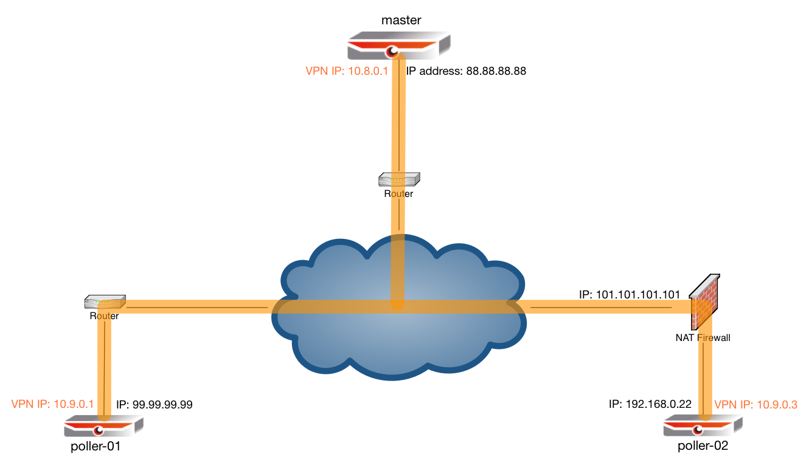

# Secured and NAT aware communication between Master and Pollers

# Intro

The master/poller setup in OP5 Monitor requires that the poller system is directly reachable from the master OP5 Monitor system in order to push configurations and send commands to the poller. Of course, there is a way to set up the poller to instead of getting its configuration pushed actively ask the master for configuration changes periodically, but this is a suboptimal setup, as there will always be a delay until new configuration changes will be taken over by the poller. So, in order to make the poller system directly available by the master a simple OpenVPN setup is the best recommended way.

Also, if you use your master/poller setup through insecure networks like over the Internet, it is also recommended to use OpenVPN to secure the connection between the master and the poller(s).

In the following howto, we will set up a secure communication between three systems: master, poller-01 and poller-02. The setup will be as follows.

 \


Let's assume we have a master that is connected to the public Internet with a publicly available IP address. Also one of our pollers, poller-01 is available with a public IP address, but the communication goes through the Internet and should therefore be encrypted. Additionally, we have a second poller, poller-02 that is located behind a NAT router and doesn't have a publicly reachable IP address. The goal is to build a VPN layer between those three systems that makes each of the machines available directly through a private VPN IP address. The communication between the two pollers will not be possible, but every of the poller will reach the master directly, and the master will reach every of the pollers.

For this example, we will use the following IP addresses:

| System    | IP Address   | VPN Tunnnel IP Address |
|-----------|--------------|------------------------|
| master    | 88.88.88.88  | 10.8.0.1               |
| poller-01 | 99.99.99.99  | 10.9.0.1               |
| poller-02 | 192.168.0.22 | 10.9.0.3               |

# Certificates and the Certificate Authority

In order to authenticate against each other and prove their identities, x509 certificates are used to secure the communication between the VPN nodes. It would be possible to use certificates bought from and signed by an official Certificate Authority, but this is not necessary. We will set up our own certificate authoriy to easily generate trusted certificates for all of our VPN nodes. This can be easily achieved by using easy-rsa.

Generally, it is also possible to set up OpenVPN to use Preshared Secrets (=Passwords), but as soon as you want to have more than a one-to-one connection (like in this case) certificates are obligatory.

## Easy-rsa Installation

The Easy-RSA package is basically a set of shell scripts that wrap Openssl commands to make it easy to build your own x509 Certificate Authority. The certificates generated by easy-rsa are used to establish trust and encryption between the OpenVPN nodes. Best practice is to install the Easy-RSA on a secure Linux server (make sure to backup), but installing it on the master OP5 server should also be fine. Although Easy-RSA was initially developed by the OpenVPN team, it is not part of the OpenVPN program package anymore, so we have to download and install it prior to configure the OpenVPN software.

**Installation of easy-rsa**

``` {.bash data-syntaxhighlighter-params="brush: bash; gutter: false; theme: Confluence" data-theme="Confluence" style="brush: bash; gutter: false; theme: Confluence"}
cd /root/
wget https://github.com/OpenVPN/easy-rsa/releases/download/2.2.2/EasyRSA-2.2.2.tgz
tar xzf EasyRSA-2.2.2.tgz
cd /root/EasyRSA-2.2.2
```

## Set up defaults

Once the easy-RSA software is installed, you can proceed to set up some variables that will save you some work later:

**Edit variables**

``` {.bash data-syntaxhighlighter-params="brush: bash; gutter: false; theme: Confluence" data-theme="Confluence" style="brush: bash; gutter: false; theme: Confluence"}
nano -w vars
```

set up your company, email address etc accordingly. These informations will be used to generate your certificates.

**vars**

``` {.bash data-syntaxhighlighter-params="brush: bash; gutter: false; theme: Confluence" data-theme="Confluence" style="brush: bash; gutter: false; theme: Confluence"}
[...]
# These are the default values for fields
# which will be placed in the certificate.
# Don't leave any of these fields blank.
export KEY_COUNTRY="SE"
export KEY_PROVINCE=""
export KEY_CITY="Stockholm"
export KEY_ORG="op5 AB"
export KEY_EMAIL="vpnadmin@op5.com"
export KEY_OU="IT infrastructure"
[...]
```

## Build the CA

Now that the basics are set up, we can start building the Certificate Authority. It's done with the following three commands. You can always accept the defaults and just press Enter for all questions you are asked.

**Set up CA**

``` {.bash data-syntaxhighlighter-params="brush: bash; gutter: false; theme: Confluence" data-theme="Confluence" style="brush: bash; gutter: false; theme: Confluence"}
source vars      # this reads the variables set up in the previous step
./clean-all      # clean the certificates directory (only do this when getting started with a brand new CA)
./build-ca       # this builds the CA itself

# output of ./build-ca looks something like this:
Generating a 2048 bit RSA private key
..................................+++
............................................+++
writing new private key to 'ca.key'
-----
You are about to be asked to enter information that will be incorporated
into your certificate request.
What you are about to enter is what is called a Distinguished Name or a DN.
There are quite a few fields but you can leave some blank
For some fields there will be a default value,
If you enter '.', the field will be left blank.
-----
Country Name (2 letter code) [SE]:
State or Province Name (full name) []:
Locality Name (eg, city) [Stockholm]:
Organization Name (eg, company) [op5 AB]:
Organizational Unit Name (eg, section) [IT infrastructure]:
Common Name (eg, your name or your server's hostname) [op5 AB CA]:
Name [EasyRSA]:
Email Address [vpnadmin@op5.com]:

```

## Build Diffie Hellman key

**Build DH key**

``` {.bash data-syntaxhighlighter-params="brush: bash; gutter: false; theme: Confluence" data-theme="Confluence" style="brush: bash; gutter: false; theme: Confluence"}
./build-dh
```

Build the Server key

As the next step, build the certificate pair (private key and public certificate) for the master server where all the pollers will connect to. Do NOT supply a password when you are asked, and do answer with "y" to sign the certificate and commit changes.

**Build server certificates**

``` {.bash data-syntaxhighlighter-params="brush: bash; gutter: false; theme: Confluence" data-theme="Confluence" style="brush: bash; gutter: false; theme: Confluence"}
./build-key-server master   # this generates the certificates for the server called "master"

# the output looks something like this
Generating a 2048 bit RSA private key
..................................+++
...............................................................+++
writing new private key to 'master.key'
-----
You are about to be asked to enter information that will be incorporated
into your certificate request.
What you are about to enter is what is called a Distinguished Name or a DN.
There are quite a few fields but you can leave some blank
For some fields there will be a default value,
If you enter '.', the field will be left blank.
-----
Country Name (2 letter code) [SE]:
State or Province Name (full name) []:
Locality Name (eg, city) [Stockholm]:
Organization Name (eg, company) [op5 AB]:
Organizational Unit Name (eg, section) [IT infrastructure]:
Common Name (eg, your name or your server's hostname) [master]:
Name [EasyRSA]:
Email Address [vpnadmin@op5.com]:
Please enter the following 'extra' attributes
to be sent with your certificate request
A challenge password []:
An optional company name []:
Using configuration from /Users/canton/tmp/EasyRSA-2.2.2/openssl-0.9.8.cnf
Check that the request matches the signature
Signature ok
The Subject's Distinguished Name is as follows
countryName           :PRINTABLE:'SE'
localityName          :PRINTABLE:'Stockholm'
organizationName      :PRINTABLE:'op5 AB'
organizationalUnitName:PRINTABLE:'IT infrastructure'
commonName            :PRINTABLE:'master'
name                  :PRINTABLE:'EasyRSA'
emailAddress          :IA5STRING:'vpnadmin@op5.com'
Certificate is to be certified until Jan  9 16:09:39 2026 GMT (3650 days)
Sign the certificate? [y/n]:y

1 out of 1 certificate requests certified, commit? [y/n]y
Write out database with 1 new entries
Data Base Updated
```

## Build clients keys

Now we build the certificate pairs for both of our pollers. As for the master, press enter to all questions including the ones for passwords (not supplying passwords) and answer "y" for sign and commit.

**build Poller certificates**

``` {.bash data-syntaxhighlighter-params="brush: bash; gutter: false; theme: Confluence" data-theme="Confluence" style="brush: bash; gutter: false; theme: Confluence"}
./build-key poller-01
./build-key poller-02
```

Now you are set up with your shiny new Certificate Authority and you can proceed installing OpenVPN on your master server

# OpenVPN on Master

## Installation

This is easy. It's just adding a package from the standard repository and adding two directories:

**Install Openvpn on Master**

``` {.bash data-syntaxhighlighter-params="brush: bash; gutter: false; theme: Confluence" data-theme="Confluence" style="brush: bash; gutter: false; theme: Confluence"}
yum install openvpn
mkdir /etc/openvpn/ccd
mkdir /etc/openvpn/keys
```

## Configuration

### Certificates

copy the following files from Easy-RSA's "keys" directory to /etc/openvpn/keys:

**Copy certificates needed for master**

``` {.bash data-syntaxhighlighter-params="brush: bash; gutter: false; theme: Confluence" data-theme="Confluence" style="brush: bash; gutter: false; theme: Confluence"}
cd /root/EasyRSA-2.2.2/keys
cp ca.crt dh2048.pem master.crt master.key /etc/openvpn/keys/
```

### Server config file

Place the attached file [server.conf](images/17073058/17269662.conf) in the /etc/openvpn/ directory of your master server.

In case your server certificate and key file are called differently from the above example, you will have to edit the following two lines in the server configuration file:

**Certificates in config file**

``` {.bash data-syntaxhighlighter-params="brush: bash; gutter: false; theme: Confluence" data-theme="Confluence" style="brush: bash; gutter: false; theme: Confluence"}
cert keys/master.crt
key keys/master.key  # This file should be kept secret
```

In case you want to use other IP addresses as drawn in the picture above, you will have to edit the configuration file a bit. Relevant lines in the file are the following ones. Within the server.conf file, all configuration parameters are well commented, so it should be easy to modify them accordingly.

**Relevant config lines for IP address ranges**

``` {.bash data-syntaxhighlighter-params="brush: bash; gutter: false; theme: Confluence" data-theme="Confluence" style="brush: bash; gutter: false; theme: Confluence"}
# Configure server mode and supply a VPN subnet
# for OpenVPN to draw client addresses from.
# The server will take 10.8.0.1 for itself,
# the rest will be made available to clients.
# Each client will be able to reach the server
# on 10.8.0.1. Comment this line out if you are
# ethernet bridging. See the man page for more info.
server 10.8.0.0 255.255.255.0

# EXAMPLE: Suppose you want to give
# Thelonious a fixed VPN IP address of 10.9.0.1.
# First uncomment out these lines:
client-config-dir ccd
route 10.9.0.0 255.255.255.0
# Then add this line to ccd/Thelonious:
#   ifconfig-push 10.9.0.1 10.9.0.2

```

### Client-Config-Directory

In order to make sure each of the pollers receives the same IP address every time it connects, we need one file per poller certificate name in the so called client configuration directory, ccd. We have created this directory before (/etc/openvpn/ccd), now we have to place one file there for each of the pollers. The name of the file must be equal as the name of the certificates issued for the pollers, and we need to assign one IP address plus one Point-To-Point IP address to each of the clients, which is the reason why you need two IPs of your pollers segment for each of the pollers.

**/etc/openvpn/ccd/poller-01**

``` {.bash data-syntaxhighlighter-params="brush: bash; gutter: false; theme: Confluence" data-theme="Confluence" style="brush: bash; gutter: false; theme: Confluence"}
ifconfig-push 10.9.0.1 10.9.0.2
```

**/etc/openvpn/ccd/poller-02**

``` {.bash data-syntaxhighlighter-params="brush: bash; gutter: false; theme: Confluence" data-theme="Confluence" style="brush: bash; gutter: false; theme: Confluence"}
ifconfig-push 10.9.0.3 10.9.0.4
```

With this, poller-01 will be assigned the IP address 10.9.0.1 every time it connects, and poller-02 will receive the IP address 10.9.0.3.

## Starting OpenVPN

Before starting the now readily configured openvpn on the master as a daemon in the background, we test the connection manually.

**Testing Openvpn Server**

``` {.bash data-syntaxhighlighter-params="brush: bash; gutter: false; theme: Confluence" data-theme="Confluence" style="brush: bash; gutter: false; theme: Confluence"}
[root@op5-system ~]# cd /etc/openvpn
[root@op5-system openvpn]# openvpn server.conf
Tue Jan 12 17:52:34 2016 OpenVPN 2.3.2 x86_64-redhat-linux-gnu [SSL (OpenSSL)] [LZO] [EPOLL] [PKCS11] [eurephia] [MH] [IPv6] built on Jan 15 2014
Tue Jan 12 17:52:34 2016 Diffie-Hellman initialized with 2048 bit key
Tue Jan 12 17:52:34 2016 Socket Buffers: R=[124928->131072] S=[124928->131072]
Tue Jan 12 17:52:34 2016 ROUTE_GATEWAY 192.168.235.2/255.255.255.0 IFACE=eth0 HWADDR=00:0c:29:32:34:13
Tue Jan 12 17:52:34 2016 TUN/TAP device tun0 opened
Tue Jan 12 17:52:34 2016 TUN/TAP TX queue length set to 100
Tue Jan 12 17:52:34 2016 do_ifconfig, tt->ipv6=0, tt->did_ifconfig_ipv6_setup=0
Tue Jan 12 17:52:34 2016 /sbin/ip link set dev tun0 up mtu 1500
Tue Jan 12 17:52:34 2016 /sbin/ip addr add dev tun0 local 10.8.0.1 peer 10.8.0.2
Tue Jan 12 17:52:34 2016 /sbin/ip route add 10.9.0.0/30 via 10.8.0.2
Tue Jan 12 17:52:34 2016 /sbin/ip route add 10.8.0.0/24 via 10.8.0.2
Tue Jan 12 17:52:34 2016 GID set to nobody
Tue Jan 12 17:52:34 2016 UID set to nobody
Tue Jan 12 17:52:34 2016 UDPv4 link local (bound): [undef]
Tue Jan 12 17:52:34 2016 UDPv4 link remote: [undef]
Tue Jan 12 17:52:34 2016 MULTI: multi_init called, r=256 v=256
Tue Jan 12 17:52:34 2016 IFCONFIG POOL: base=10.8.0.4 size=62, ipv6=0
Tue Jan 12 17:52:34 2016 IFCONFIG POOL LIST
Tue Jan 12 17:52:34 2016 Initialization Sequence Completed
```

If this works properly, you can stop the manually started openvpn by hitting Ctrl-C and make openvpn start as a system service from now on.

**Starting openvpn as a daemon**

``` {.bash data-syntaxhighlighter-params="brush: bash; gutter: false; theme: Confluence" data-theme="Confluence" style="brush: bash; gutter: false; theme: Confluence"}
chkconfig openvpn on
service openvpn start
```

Now you are fully set up with your master and you can proceed with the pollers.

# OpenVPN on the Pollers

## Installation

This is equal as on the master, with the difference that we do not need a ccd directory here.

**Installation of openvpn on poller**

``` {.bash data-syntaxhighlighter-params="brush: bash; gutter: false; theme: Confluence" data-theme="Confluence" style="brush: bash; gutter: false; theme: Confluence"}
yum install openvpn
mkdir /etc/openvpn/keys
```

## Configuration

### Certificates

Copy the following files from the master's easy-rsa keys directory to the poller's /etc/openvpn/keys directory (I recommend using scp for this):

- ca.crt
- poller-01.crt
- poller-01.key

For poller-02, use poller-02.crt and poller-02.key respectively.

### Configuration file

Use the attached [client.conf](images/17073058/17269663.conf) and place it in the /etc/openvpn/ directory of the poller.

Make sure to set up the following two lines with the correct names of certificate and key

**key names setup**

``` {.bash data-syntaxhighlighter-params="brush: bash; gutter: false; theme: Confluence" data-theme="Confluence" style="brush: bash; gutter: false; theme: Confluence"}
cert keys/poller-01.crt
key keys/poller-01.key
```

## Startup

Now you can start openvpn from command line to see all the connection messages. If the connection succeeds, the process should look like this.

**Testing Openvpn**

``` {.bash data-syntaxhighlighter-params="brush: bash; gutter: false; theme: Confluence" data-theme="Confluence" style="brush: bash; gutter: false; theme: Confluence"}
cd /etc/openvpn
openvpn client.conf

# output will look like this
Tue Jan 12 18:08:14 2016 OpenVPN 2.3.2 x86_64-redhat-linux-gnu [SSL (OpenSSL)] [LZO] [EPOLL] [PKCS11] [eurephia] [MH] [IPv6] built on Jan 15 2014
Tue Jan 12 18:08:14 2016 Socket Buffers: R=[124928->131072] S=[124928->131072]
Tue Jan 12 18:08:14 2016 NOTE: UID/GID downgrade will be delayed because of --client, --pull, or --up-delay
Tue Jan 12 18:08:14 2016 UDPv4 link local (bound): [undef]
Tue Jan 12 18:08:14 2016 UDPv4 link remote: [AF_INET]192.168.235.141:1194
Tue Jan 12 18:08:14 2016 TLS: Initial packet from [AF_INET]192.168.235.141:1194, sid=d90bbde4 5b45cb96
Tue Jan 12 18:08:14 2016 VERIFY OK: depth=1, C=SE, ST=St, L=Stockholm, O=op5, CN=myCA, name=EasyRSA, emailAddress=vpnadmin@op5.com
Tue Jan 12 18:08:14 2016 VERIFY OK: nsCertType=SERVER
Tue Jan 12 18:08:14 2016 VERIFY OK: depth=0, C=SE, ST=St, L=Stockholm, O=op5, CN=master, name=EasyRSA, emailAddress=vpnadmin@op5.com
Tue Jan 12 18:08:14 2016 Data Channel Encrypt: Cipher 'BF-CBC' initialized with 128 bit key
Tue Jan 12 18:08:14 2016 Data Channel Encrypt: Using 160 bit message hash 'SHA1' for HMAC authentication
Tue Jan 12 18:08:14 2016 Data Channel Decrypt: Cipher 'BF-CBC' initialized with 128 bit key
Tue Jan 12 18:08:14 2016 Data Channel Decrypt: Using 160 bit message hash 'SHA1' for HMAC authentication
Tue Jan 12 18:08:14 2016 Control Channel: TLSv1, cipher TLSv1/SSLv3 DHE-RSA-AES256-SHA, 2048 bit RSA
Tue Jan 12 18:08:14 2016 [op5master] Peer Connection Initiated with [AF_INET]192.168.235.141:1194
Tue Jan 12 18:08:16 2016 SENT CONTROL [op5master]: 'PUSH_REQUEST' (status=1)
Tue Jan 12 18:08:16 2016 PUSH: Received control message: 'PUSH_REPLY,route 10.8.0.1,topology net30,ping 5,ping-restart 30,ifconfig 10.9.0.1 10.9.0.2'
Tue Jan 12 18:08:16 2016 OPTIONS IMPORT: timers and/or timeouts modified
Tue Jan 12 18:08:16 2016 OPTIONS IMPORT: --ifconfig/up options modified
Tue Jan 12 18:08:16 2016 OPTIONS IMPORT: route options modified
Tue Jan 12 18:08:16 2016 ROUTE_GATEWAY 192.168.235.2/255.255.255.0 IFACE=eth0 HWADDR=00:0c:29:51:ba:04
Tue Jan 12 18:08:16 2016 TUN/TAP device tun0 opened
Tue Jan 12 18:08:16 2016 TUN/TAP TX queue length set to 100
Tue Jan 12 18:08:16 2016 do_ifconfig, tt->ipv6=0, tt->did_ifconfig_ipv6_setup=0
Tue Jan 12 18:08:16 2016 /sbin/ip link set dev tun0 up mtu 1500
Tue Jan 12 18:08:16 2016 /sbin/ip addr add dev tun0 local 10.9.0.1 peer 10.9.0.2
Tue Jan 12 18:08:16 2016 /sbin/ip route add 10.8.0.1/32 via 10.9.0.2
Tue Jan 12 18:08:16 2016 GID set to nobody
Tue Jan 12 18:08:16 2016 UID set to nobody
Tue Jan 12 18:08:16 2016 Initialization Sequence Completed
```

Once this proceeds, the openvpn service can be set up to start as a daemon, after pressing Ctrl-C to terminate the test run.

**Set up openvpn as daemon**

``` {.bash data-syntaxhighlighter-params="brush: bash; gutter: false; theme: Confluence" data-theme="Confluence" style="brush: bash; gutter: false; theme: Confluence"}
chkconfig openvpn on
service openvpn start
```

Repeat the above for all pollers!

# Test communication

Now that OpenVPN is properly set up and started on all the systems, each of the pollers should be able to ping the master:

**Ping master**

``` {.bash data-syntaxhighlighter-params="brush: bash; gutter: false; theme: Confluence" data-theme="Confluence" style="brush: bash; gutter: false; theme: Confluence"}
[root@op5-system openvpn]# ping 10.8.0.1
PING 10.8.0.1 (10.8.0.1) 56(84) bytes of data.
64 bytes from 10.8.0.1: icmp_seq=1 ttl=64 time=0.454 ms
64 bytes from 10.8.0.1: icmp_seq=2 ttl=64 time=0.506 ms
64 bytes from 10.8.0.1: icmp_seq=3 ttl=64 time=0.440 ms
64 bytes from 10.8.0.1: icmp_seq=4 ttl=64 time=0.446 ms
^C
--- 10.8.0.1 ping statistics ---
4 packets transmitted, 4 received, 0% packet loss, time 3072ms
rtt min/avg/max/mdev = 0.440/0.461/0.506/0.033 ms
```

And the master should be able to ping each of the pollers:

**Ping Poller**

``` {.bash data-syntaxhighlighter-params="brush: bash; gutter: false; theme: Confluence" data-theme="Confluence" style="brush: bash; gutter: false; theme: Confluence"}
[root@op5-system openvpn]# ping 10.9.0.1
PING 10.9.0.1 (10.9.0.1) 56(84) bytes of data.
64 bytes from 10.9.0.1: icmp_seq=14 ttl=64 time=0.562 ms
64 bytes from 10.9.0.1: icmp_seq=15 ttl=64 time=0.548 ms
64 bytes from 10.9.0.1: icmp_seq=16 ttl=64 time=0.394 ms
64 bytes from 10.9.0.1: icmp_seq=17 ttl=64 time=0.407 ms
^C
--- 10.9.0.1 ping statistics ---
17 packets transmitted, 4 received, 76% packet loss, time 16998ms
rtt min/avg/max/mdev = 0.394/0.477/0.562/0.082 ms
```

# Set up Master/Poller configuration

Now that your network communication layer is set up correctly, you can proceed with the normal process of configuring [Distributed Monitoring](https://kb.op5.com/display/DOC/Distributed+Monitoring) as described in the [Administrator Manual](https://kb.op5.com/display/DOC/op5+Monitor+Administrator+Manual). Just make sure to use the VPN ip addresses to establish the communication between the nodes. I recommend to add host names tied to the VPN addresses of each of the nodes in every host's /etc/hosts files in order to resolve every of the host names with the VPN IP addresses automatically prior to set up the Master/Poller communication.

**Content by label**

There is no content with the specified labels
