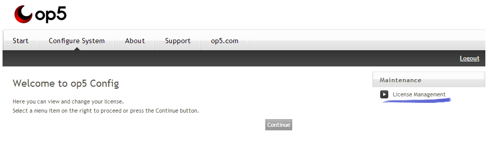

# License file installation procedures

## Question

* * * * *

How do I install an OP5 Monitor software license file onto a an OP5 server (master or poller)?

## Answer

* * * * *

This depends on whether the OP5 server is a more recent setup, an older (upgraded) setup, or hosted on Red Hat Enterprise Linux (RHEL) 7 or CentOS 7.

### Newer Servers and EL7 Servers

The original steps (see below) depended on the 'op5config' scripts installed with the OP5 web pages. These were removed during the v7.3 series and never included with the EL7 setups. While we work to modernize and reintroduce op5config (see bug MON-10152 - Create an Upload license interface For refinement ), we offer these manual instructions. These will also work with older setups:

1.  Upload the license file to '/etc/op5license/op5license.lic' on the OP5 server. The most common approach is to use SCP;
2.  Change the file's ownership to 'monitor:apache';
3.  Restart the OP5 service: "mon restart".

### Older and Upgraded Servers

The license file is easily installed by following the instructions found below.

 

1.  Use your web browser to access your op5 server via its host name or IP address. Click on the menu option called *Configure System* (as can be seen in the image below) once the home page has been loaded.
     
     
2.  To access the configuration, enter the system's root password and hit the *Login* button. In the op5 Virtual Appliance, the default password is *monitor*.*
     
     *
3.  Once successfully logged in, click on the *License Management* option at the right hand side of the page. The screenshot below displays only this single option, but your op5 system might have several additional menu options.
     
     
4.  Now click on the *Choose File* button, and finally select and upload the license file received from op5.

