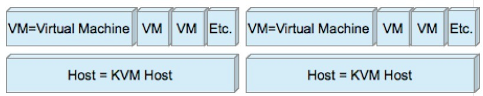

# Monitor KVM virtual servers with op5 Monitor

 

### **An overview of supported commands and sub-command for op5 Monitor 5.x and 6.x**

VM – Virtual Machine

Host – KVM host

Note - for install and prerequisitions please read ["How to monitor kvm..." ](https://kb.op5.com/x/jIIK)

 

|:--|
|**Level**

**Command**

**Sub-command**|VM

\* cpu - shows cpu info

 |VM

\* mem - shows mem info

 |VM

\* net - shows net info

 |VM

 

TX bytes, TX packets, TX errors, TX drops, RX bytes, RX packets, RX errors, RX drops|VM

\* io - shows disk I/O info

 |VM

 

Read bytes, Read requests, Write bytes, Write requests, Errors|Host

\* list - shows VM's list and their statuses

 |Host

\* pool - shows pool info

 |Host

 

+ (name) - query particular pool with name (name)|Host

 

\^ list pools and their statuses|Host

\* volume - shows volume info

 |Host

 

+ (name) - query particular volume in pool with full name (name)|Host

 

\^ list volumes and their statuses|Host

\* running - queries VM state

 |Host

 

(name) - query particular VM state by it's name (name)|

